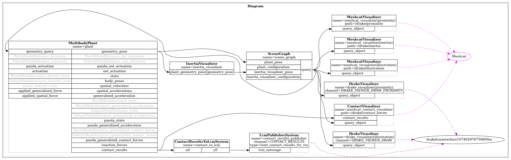

# Multibody simulation

Welcome to the second Drake tutorial!
In this tutorial, you will learn how to:

* Load a robot model (URDF/SDF).
* Understand frames, joints, and links.
* Add a simple environment (ground plane).
* Visualize your robot in MeshCat.Loading a robot model (URDF/SDF).


# MultibodyPlant
The `MultibodyPlant` class in is central to modeling interconnected bodies, such as robotic systems. It supports parsing robot models from formats like .URDF, .SDF, or .MJCF, representing them as tree structures. This class provides APIs to add bodies, joints, forces, and sensors, enabling kinematic and dynamic computations. In this tutorial, you will learn how to:
* Define a multibody scenario in Drake.
* Inspect its joints and links in Meshcat.
* Use the `MultibodyPlant` class to parse your robot model.
* Add a ground plane.
* Construct and simulate a diagram of your plant.

You can run the example script [tutorial_2a.py](../python_tutorials/tutorial_2a.py):
```sh
cd ~/robotics_ws/python_tutorials
python3 ./tutorial_2a.py
```
Switch between visualization and simulation modes using the visualize flag in the script:
```python
visualize = True   # MeshCat visualization only
visualize = False  # Run full simulation
```

***Note:** For a primer on terminology, see [01_Introduction.md]().  For detailed info on the `MultibodyPlant`, see [Drake\'s
documentation of Multibody](https://drake.mit.edu/doxygen_cxx/classdrake_1_1multibody_1_1_multibody_plant.html#details).*

## Scene file formats
Drake can parse models using the `drake::multibody::Parser`. compatible with formats like Unified Robot Description Format (URDF), Simulation Description Format (SDFormat), and limited support for MJCF (Mujoco XML).

### Viewing models
Drake provides a `ModelVisualizer` class to visualize models interactively. Example: Panda robot URDF. 
```Python
# Import some basic libraries and functions for this tutorial.
import os
import numpy as np
import pydot
from IPython.display import SVG, display
from pydrake.common import temp_directory
from pydrake.geometry import StartMeshcat, SceneGraph, MeshcatVisualizer
from pydrake.math import RotationMatrix, RigidTransform, RollPitchYaw
from pydrake.multibody.parsing import Parser
from pydrake.multibody.plant import AddMultibodyPlantSceneGraph, MultibodyPlant
from pydrake.systems.analysis import Simulator
from pydrake.systems.framework import DiagramBuilder
from pydrake.visualization import AddDefaultVisualization, ModelVisualizer
from pydrake.all import WeldJoint, ConstantVectorSource

# Start the visualizer. The cell will output an HTTP link after the execution.
# Click the link and a MeshCat tab should appear in your browser.
meshcat = StartMeshcat()
```

```python
# First we will choose our definition file of the panda robot
model_path = get_relative_path("../../models/descriptions/robots/panda_fr3/urdf/panda_fr3.urdf")
# Create a model visualizer and add the robot arm.
visualizer = ModelVisualizer(meshcat=meshcat)
visualizer.parser().AddModelsFromUrl("file://" + model_path)

# Start the interactive visualizer.
# Note: the visualizer will be closed automatically when the script exits or  
# when the "Stop Running" button in MeshCat is clicked.
visualizer.Run()
```
This code runs a viszualization in meshcat, when run switch to the MeshCat tab (URL printed in the terminal) to see the robot, as shown below.
```sh
$ python3 tutorial_2a.py 
INFO:drake:Meshcat listening for connections at http://localhost:7000
INFO:drake:Click 'Stop Running' or press Esc to quit
```

Click "Open Controls" to unfold the control panel. Try adjusting the sliding bars to observe the kinematics of the robot.
<div style="text-align: center;">
    
</div>
Morever, In the control panel, unfold the Scene/drake menu. By default, only the "illustration" geomtry is displayed (the Drake name for visual geometry). Toggle the "proximity" checkbox to also show the collision geometry (in red), or the "inertia" checkbox to also show each body's equivalent inertia ellipsoid (in blue). Use the α sliders to adjust the transparancy of the geometry. When debugging a simulation, it's important to keep these extra views in mind!!.

### Addtional notes
Drake supports the composition of complex robotic scenes by nesting models and integrating multiple file formats. For example, SDFormat files can include URDF models allowing for modular robot descriptions. See [husky_panda.sdf](https://github.com/Coryx99/drake_brubotics/blob/main/models/descriptions/hybrids/husky_panda.sdf) for an example.

## Loading models into the scene
Let's continue by loading our robot model into a simulation scene. We'll define a `create_sim_scene` function, to set up a `MultibodyPlant` and register it to a scene graph. This plant can be either continuous or discrete, depending on the time step you choose. A non-zero time step means a discrete plant, while zero means continuous. The `Simulator` will step through a discrete plant using the given time_step, but will allow a numerical integrator to choose how to advance time for a continuous MultibodyPlant.
```python
def create_sim_scene(sim_time_step):   
    """
    This function creates a simulation scene using the Drake and the Panda robot model.

    Args:
        sim_time_step (float): The time step for the simulation.

    Returns:
        Diagram: The created simulation diagram.
    """
    # Clean up the Meshcat instance.
    meshcat.Delete()
    meshcat.DeleteAddedControls()

    builder = DiagramBuilder()
    plant_1, scene_graph = AddMultibodyPlantSceneGraph(builder, time_step=sim_time_step)
    Parser(plant_1).AddModelsFromUrl("file://" + model_path)

    # Finalize the plant after loading the scene.
    plant_1.Finalize()

    # Add visualization to see the geometries.
    AddDefaultVisualization(builder=builder, meshcat=meshcat)
    diagram = builder.Build()
    return diagram
```
Once the `MultibodyPlant` is set up, the function returns a diagram that ready for Drake `Simulator` (a default context is used in this case). 

**Reminder:** `Context` + `Diagram` are all the simulator needs to run. Given the same context, simulation is deterministic.

## Inspecting Joints and Links
Once the model is loaded, you can inspect its elements:
```Python
# After creating a plant
plant, _ = AddMultibodyPlantSceneGraph(DiagramBuilder())
Parser(plant).AddModelsFromUrl("file://" + model_path)
plant.Finalize()

print("Bodies in the plant:")
for body_index in plant.GetBodyIndices(plant):
    print(plant.get_body(body_index).name())

print("\nJoints in the plant:")
for joint_index in plant.GetJointIndices(plant):
    print(plant.get_joint(joint_index).name())
```

This helps you understand the robot structure: links, joints, and fixed or movable parts.

## Running a simulation
Now that we have everything set up, to let's run the simulator and visualize it in a MeshCat tab, here we will run the default simulation setting but we will set some configurations (We will go more in depth in [03_contact&solvers.md](./03_contact&solvers.md)).
```Python
diagram = create_sim_scene(sim_time_step = 0.001)

# Initialize a simulation with a default context
simulator = Simulator(diagram)
simulator.set_target_realtime_rate(1) 
simulator.Initialize()
simulator.set_publish_every_time_step(True) # Publish every simulation step based on the system definition

sim_time = 10  # the simulation time


meshcat.StartRecording() # Records the simulation
simulator.AdvanceTo(sim_time) # Runs the simulation for sim_time seconds
meshcat.PublishRecording() # Replays the simulation
```
This simple simulation represents our non actuated panda robot, in the simulation the robot will fall downward due to the gravity effect. You can also use the play/pause/reset buttom in meshcat to re-run the simulation.

### Visualizing your diagram
Rendering the block diagram is a good way for inspecting the connections of our system. The following code extracts and saves the diagram as an image file.
```Python
# Save the block diagram as an image file
svg_data = diagram.GetGraphvizString(max_depth=2)
graph = pydot.graph_from_dot_data(svg_data)[0]
image_path = "block_diagram_testpy.png"  # Change this path as needed
graph.write_png(image_path)
print(f"Block diagram saved as: {image_path}")
```
The image file below displays the input and output ports of our MultibodyPlant, which we will refer to throughout the tutorials. For a detailed description for each of the input/output ports of the Multibody plant, refer [here](https://drake.mit.edu/doxygen_cxx/group__systems__diagram.html).
<div style="text-align: center;">
    
</div>

# Next steps
This tutorial helps you set up the physics engine (MultibodyPlant) and visualize the simulation in MeshCat. However, most robotics simulations require more. Next, you might need to model the sensors, the low-level control system, and eventually even the high-level perception, planning, and control systems for a real-world robot platform.

Next, we will define a controller as a system block and connect it to the MultibodyPlant for set-point regulation. Proceed to [02b_dynamics.md](./02b_dynamics.md).