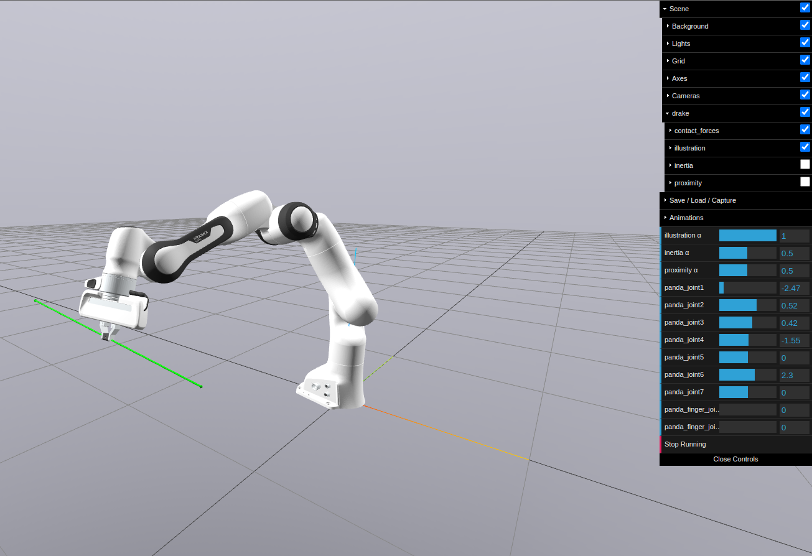
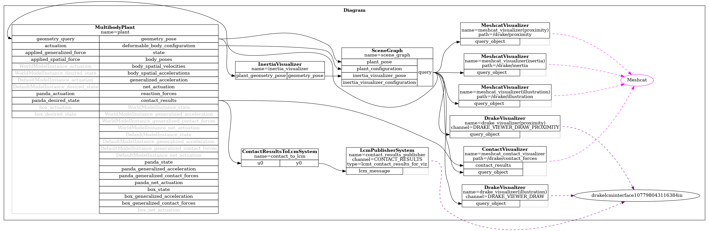

# Multibody simulation
The `MultibodyPlant` class in is central to modeling interconnected bodies, such as robotic systems. It supports parsing robot models from formats like .URDF, .SDF, or .MJCF, representing them as tree structures. This class provides APIs to add bodies, joints, forces, and sensors, enabling kinematic and dynamic computations. In this tutorial, you will learn how to:
* Parse and load a robot model using the `MultibodyPlant` class.
* Add extra bodies (a ground plane and a box).
* Inspect the model’s bodies and joints.
* Set initial states (joint positions and free-body poses).
* Build a system diagram and simulate it.
* Visualize everything in MeshCat.

Run the script [tutorial_02.py](../tutorial_scripts/tutorial_02.py):
```sh
cd ~/Robotics-II/tutorial_scripts/
python3 ./tutorial_02.py
```
You can switch between visualization-only and simulation modes by changing the `visualize` flag at the top of the script:
```python
visualize = True   # MeshCat visualization only
visualize = False  # Run full simulation
```

***Note:** For a primer on terminology, see [01_Introduction.md]().  For detailed info on the `MultibodyPlant`, see [Drake\'s
documentation of Multibody](https://drake.mit.edu/doxygen_cxx/classdrake_1_1multibody_1_1_multibody_plant.html#details).*

## Robot visualization
Drake can parse models using the `drake::multibody::Parser`. compatible with formats like Unified Robot Description Format (URDF), Simulation Description Format (SDFormat), and limited support for MJCF (Mujoco XML).

### Viewing models
Drake provides a `ModelVisualizer` class to visualize models interactively. Example: Panda robot URDF. 
```Python
# Import some basic libraries and functions for this tutorial.
import os
import numpy as np
import pydot
from IPython.display import SVG, display
from pydrake.common import temp_directory
from pydrake.geometry import StartMeshcat, SceneGraph, MeshcatVisualizer
from pydrake.math import RotationMatrix, RigidTransform, RollPitchYaw
from pydrake.multibody.parsing import Parser
from pydrake.multibody.plant import AddMultibodyPlantSceneGraph, MultibodyPlant
from pydrake.systems.analysis import Simulator
from pydrake.systems.framework import DiagramBuilder
from pydrake.visualization import AddDefaultVisualization, ModelVisualizer
from pydrake.all import WeldJoint, ConstantVectorSource

# Start the visualizer. The cell will output an HTTP link after the execution.
# Click the link and a MeshCat tab should appear in your browser.
meshcat = StartMeshcat()
```

```python
# First we will choose our definition file of the panda robot
model_path = os.path.join(
    "..", "models", "descriptions", "robots", "arms", "franka_description", "urdf", "panda_arm_hand.urdf"
)
# Create a model visualizer and add the robot arm.
visualizer = ModelVisualizer(meshcat=meshcat)
visualizer.parser().AddModelsFromUrl("file://" + model_path)

# Start the interactive visualizer.
# Note: the visualizer will be closed automatically when the script exits or  
# when the "Stop Running" button in MeshCat is clicked.
visualizer.Run()
```
This code runs a viszualization in meshcat, when run switch to the MeshCat tab (URL printed in the terminal) to see the robot, as shown below.
```sh
$ python3 tutorial_2a.py 
INFO:drake:Meshcat listening for connections at http://localhost:7000
INFO:drake:Click 'Stop Running' or press Esc to quit
```

Click "Open Controls" to unfold the control panel. Try adjusting the sliding bars to observe the kinematics of the robot.
<div style="text-align: center;">
    
</div>
Morever, In the control panel, unfold the Scene/drake menu. By default, only the "illustration" geomtry is displayed (the Drake name for visual geometry). Toggle the "proximity" checkbox to also show the collision geometry (in red), or the "inertia" checkbox to also show each body's equivalent inertia ellipsoid (in blue). Use the α sliders to adjust the transparancy of the geometry. When debugging a simulation, it's important to keep these extra views in mind!!.

### Addtional notes
Drake supports the composition of complex robotic scenes by nesting models and integrating multiple file formats. For example, SDFormat files can include URDF models allowing for modular robot descriptions. See [husky_panda.sdf](../models/descriptions/hybrids/husky_panda.sdf) for an example.

## Robot Simulation
Let's continue by loading our robot model into a simulation scene. We'll define a `create_sim_scene` function, to set up a `MultibodyPlant` and register it to a scene graph. This plant can be either continuous or discrete, depending on the time step you choose. A non-zero time step means a discrete plant, while zero means continuous. The `Simulator` will step through a discrete plant using the given time_step, but will allow a numerical integrator to choose how to advance time for a continuous MultibodyPlant.
```python
def create_sim_scene(sim_time_step):   
    """
    Create a simulation scene with the Panda robot and optional extra bodies.

    Args:
        sim_time_step (float): The discrete time step for the plant.

    Returns:
        diagram (Diagram): A system diagram with the robot, optional objects, and visualization.
    """
    # Clean up the Meshcat window (so we start from an empty scene each time)
    meshcat.Delete()
    meshcat.DeleteAddedControls()

    # A DiagramBuilder is where we construct our system
    builder = DiagramBuilder()

    # Add a MultibodyPlant (for physics) and a SceneGraph (for geometry/visualization)
    plant, scene_graph = AddMultibodyPlantSceneGraph(builder, time_step=sim_time_step)

    # Load the Panda robot from URDF with the 
    panda_model = Parser(plant).AddModelsFromUrl("file://" + os.path.abspath(model_path))[0]

    # Fix the Panda base to the world so it doesn’t fall
    base_link = plant.GetBodyByName("panda_link0")
    plant.WeldFrames(plant.world_frame(), base_link.body_frame())

    # ----------------------------------------------------------------
    # Extra bodies (floor + box) if requested
    # ----------------------------------------------------------------
    if add_bodies:
        # --- Ground plane ---
        # A HalfSpace is an infinite plane (we put it at z=0).
        # We add both collision (for physics) and visual (for rendering).
        plant.RegisterCollisionGeometry(
            plant.world_body(),
            RigidTransform(),    # Pose (identity, so plane at z=0)
            HalfSpace(),         # Geometry type
            "ground_collision",
            CoulombFriction(0.9, 0.8)   # Friction coefficients
        )
        plant.RegisterVisualGeometry(
            plant.world_body(),
            RigidTransform(),
            HalfSpace(),
            "ground_visual",
            [0.5, 0.5, 0.5, 1.0]  # RGBA color (gray)
        )

        # --- A box ---
        # Add a model instance for the box
        box_model = plant.AddModelInstance("box")

        # Define mass and inertia for the box
        box_inertia = SpatialInertia(
            mass=0.5,                          # kg
            p_PScm_E=np.zeros(3),              # center of mass at the body origin
            G_SP_E=UnitInertia(0.01, 0.01, 0.01)  # simple rotational inertia
        )
        box = plant.AddRigidBody("Box", box_model, box_inertia)

        # Define box shape (10cm cube)
        box_shape = DrakeBox(0.1, 0.1, 0.1)

        # Add collision geometry to the box
        plant.RegisterCollisionGeometry(
            box,
            RigidTransform(),   # Pose relative to the box frame
            box_shape,
            "box_collision",
            CoulombFriction(0.9, 0.8)
        )

        # Add visual geometry to the box
        plant.RegisterVisualGeometry(
            box,
            RigidTransform(),
            box_shape,
            "box_visual",
            [0.8, 0.2, 0.2, 1.0]  # red color
        )

    # ----------------------------------------------------------------
    # Finalize plant: no more bodies or joints can be added after this
    # ----------------------------------------------------------------
    plant.Finalize()
  
    # ----------------------------------------------------------------
    # Add visualization
    # ----------------------------------------------------------------
    AddDefaultVisualization(builder=builder, meshcat=meshcat)

    # Build the final diagram (plant + scene graph + viz)
    diagram = builder.Build()
    return diagram
```
Once the `MultibodyPlant` is set up, the function returns a diagram that ready for Drake `Simulator` (a default context is used in this case). 

<!-- **Reminder:** `Context` + `Diagram` are all the simulator needs to run. Given the same context, simulation is deterministic. -->

## Inspecting Joints and Links
Moreever, you can inspect the robots links and joints:
```Python
    # ----------------------------------------------------------------
    # Inspect contents: print bodies and joints of the Panda
    # ----------------------------------------------------------------
    print("\nBodies in the Panda model:")
    for body_index in plant.GetBodyIndices(panda_model):
        print("  -", plant.get_body(body_index).name())
        print(plant.get_body(body_index).default_mass())

    print("\nJoints in the Panda model:")
    for joint_index in plant.GetJointIndices(panda_model):
        print("  -", plant.get_joint(joint_index).name())

    # ----------------------------------------------------------------
    # Set initial/default states
    # ----------------------------------------------------------------
    # Panda arm default joint configuration
    plant.SetDefaultPositions(panda_model, [
        0.0, -0.785, 0.0, -2.356, 0.0, 1.571, 0.774, 0, 0
    ])
    
    if add_bodies:
        # ------------------------------------------------------------
        # Two ways of setting the initial pose of a floating body (the box)
        # ------------------------------------------------------------

        # (1) Using SetDefaultPositions:
        # This requires encoding the pose in the format
        # [qw, qx, qy, qz, x, y, z] for the quaternion + position.
        # Here: box is placed at (0.5, 0, 0.5) with unit quaternion [1, 0, 0, 0].
        plant.SetDefaultPositions(box_model, [1, 0, 0, 0, 0.5, 0.0, 0.5])  

        # (2) Using SetDefaultFreeBodyPose:
        # This is usually clearer because we work directly with a RigidTransform.
        # Here: we place the box at (0.5, 0, 0.5) with identity rotation.
        X_WBox = RigidTransform([0.5, 0.0, 0.5])
        plant.SetDefaultFreeBodyPose(box, X_WBox)

    # ----------------------------------------------------------------
    # Inspect initial state
    # ----------------------------------------------------------------
    plant_context = plant.CreateDefaultContext()
    print("\nInitial Panda joint state (positions + velocities):")
    print(plant.GetPositionsAndVelocities(plant_context, panda_model))
    
    if add_bodies:
        # For floating bodies we can inspect in two ways:
        # (a) From its model instance: quaternion + position + velocities
        print("\nInitial box state (pose + velocities):")
        print(plant.GetPositionsAndVelocities(plant_context, box_model))
        
        # (b) As a RigidTransform (rotation + translation matrix)
        print("\nInitial pose of the box (RigidTransform):")
        print(plant.GetFreeBodyPose(plant_context, box))

```
Use this to confirm and get familiar with the robot structure, links, and joints. For more info, see [RigidBody docs](https://drake.mit.edu/doxygen_cxx/classdrake_1_1multibody_1_1_rigid_body.html).

## Running a simulation
Now that we have everything set up, to let's run the simulator and visualize it in a MeshCat tab, here we will run the default simulation setting but we will set some configurations (We will go more in depth in [03_contact&solvers.md](./03_contact&solvers.md)).
```Python
# Otherwise, build the scene and simulate
diagram = create_sim_scene(sim_time_step)

# Create and configure the simulator
simulator = Simulator(diagram)
simulator.set_target_realtime_rate(1.0)  # Try to match real time
simulator.Initialize()
simulator.set_publish_every_time_step(True)  # publish at each step

sim_time = 5.0  # seconds of simulated time

meshcat.StartRecording()         # Start recording the sim
simulator.AdvanceTo(sim_time)    # Runs the simulation for sim_time seconds
meshcat.PublishRecording()       # Publish recording to replay in Meshcat
```

This simple simulation represents our non actuated panda robot, in the simulation the robot will fall downward hitting the floor due to the gravity effect. You can also use the play/pause/reset buttom in meshcat to re-play the simulation.

### Visualizing your diagram
Rendering the block diagram is a good way for inspecting the connections of our system. The following code extracts and saves the diagram as an image file.
```Python
# Save system block diagram as PNG
svg_data = diagram.GetGraphvizString(max_depth=2)
graph = pydot.graph_from_dot_data(svg_data)[0]
image_path = "figures/block_diagram_02.png"
graph.write_png(image_path)
print(f"\nBlock diagram saved as: {image_path}")
```
The image file below displays the input and output ports of our MultibodyPlant, which we will refer to throughout the tutorials. 
<div style="text-align: center;">
    
</div>
<!-- Some important inpute/output ports that you might need for building your robotics application are: **modelinstance**_actuation_inpute_port and applied_spacial_force. *modelinstance**_state, *modelinstance**_geenralized_acceleration, *modelinstance**_geenralized_contact forces, body_poses. -->

For a detailed description for each of the input/output ports of the Multibody plant, refer [here](https://drake.mit.edu/doxygen_cxx/group__systems__diagram.html).

# Next steps
This tutorial shows you how to set up the physics engine (`MultibodyPlant`) and visualize the simulation in MeshCat. To build more advanced robotics applications in simulation, you will also need controllers and additional system blocks that interact with the robot model.

Therefore proceed to tutorial [03_Dynamics.md](./03_Dynamics.md), where we will define a controller as a system block and connect it to the MultibodyPlant for the set-point regulation. 