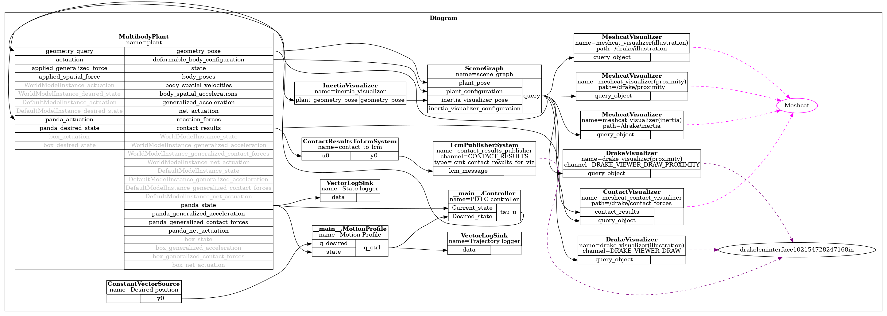

# Modelling dynamical systems
The previous tutorial provided an introduction to adding, viewing, and simulating your robot in Drake. In this tutorial, we will delve deeper into controlling our simulated robot for setpoint regulation **without contact**.

Drake's system modeling approach is inspired by MATLAB's Simulink but without the graphical user interface. It focuses on introspecting the structure of governing equations, allowing for advanced algorithms for analysis, system identification, and feedback or state estimator design. In this tutorial, you will learn how to:

* Implement a controller as a system block (`LeafSystem`).
* Integrate your controller into a simulation diagram.
* Compute and inspect your system’s dynamics.
* Log and plot joint positions and velocities to analyze performance.


We will be running the tutorial example [tutorial_03.py](../tutorial_scripts/tutorial_03.py): 
```sh
cd ~/Robotics-II/tutorial_scripts 
python3 ./tutorial_03.py
```

## Writing your own system block
Before implementing our controller, we need to understand what a `LeafSystem` is. A `LeafSystem` is a class in Drake that provides the basic functionality for a system, including the declaration of the input and output ports of the system. Every user-defined system should derive from the `Drake::Systems::LeafSystem` class. 
<div style="text-align: center;">
    
</div>


### Deriving from `LeafSystem`
There are various ways to define a leaf system; the simplest approach is using the templates provided by Drake, such as `SymbolicVectorSystem` class. This class, for example, simplifies the creation of state-space systems using symbolic expressions. However, for systems with multiple inputs and outputs, mixed discrete and continuous dynamics, hybrid dynamics with guards and resets, constraints, and stochastic systems, a flexible approach is to derive directly from  `Drake::Systems::LeafSystem`.

#### PD controller example
We will use the `LeafSystem` to construct a PD controller with gravity compensation. We will define 2 input ports for our controller block: one for the desired robot state "$q_r$" and another to feedback the state of the robot $q$ and $\dot{q}$. The output of our controller is given as:
$$\tau_u = K_P (q_r - q) - K_D \dot{q} + g(q) ,$$
where $K_P$ and $K_D$ are the proportional and derivative gains, respectively.

The state of a multibody system is given by its generalized positions vector $q$, and its generalized velocities vector $\dot{q}$. Our Panda robot URDF has 9 actuated degrees of freedom corresponding to the 7 revolute joints and 2 prismatic joints (left and right fingers). Thus, we declare our current state input with a size of 18, equal to the state vector provided by the multibody plant of the form $x = [q, \dot{q}]$.
<div style="text-align: center;">
    
</div>

When initializing the controller, we will pass our plant to perform dynamic calculations in a local context. Additionally, we will declare a periodic publisher that reports our system dynamics, as explained below and defined in [below](#inspecting-the-dynamics-the-manipulator-equations).
```python
class Controller(LeafSystem):
    def __init__(self, plant):
        super().__init__()

        # Declare input ports for desired and current states
        self._current_state_port = self.DeclareVectorInputPort(name="Current_state", size=18)
        self._desired_state_port = self.DeclareVectorInputPort(name="Desired_state", size=9)

        # PD+G gains (Kp and Kd)
        self.Kp_ = [120.0, 120.0, 120.0, 100.0, 50.0, 45.0, 15.0, 120, 120]
        self.Kd_ = [8.0, 8.0, 8.0, 5.0, 2.0, 2.0, 2.0, 5, 5]

        # Store plant and context for dynamics calculations
        self.plant, self.plant_context_ad = plant, plant.CreateDefaultContext()

        # Declare discrete state and output port for control input (tau_u)
        state_index = self.DeclareDiscreteState(9)  # 9 state variables.
        self.DeclareStateOutputPort("tau_u", state_index)  # output: y=x.
        self.DeclarePeriodicDiscreteUpdateEvent(
            period_sec=1/1000,  # One millisecond time step.
            offset_sec=0.0,  # The first event is at time zero.
            update=self.compute_tau_u) # Call the Update method defined below.
        
        # Create a periodic event to publish the Dynamics of our robot.
        self.DeclarePeriodicPublishEvent(1, 10, self.PublishDynamics) 
    
    def compute_tau_u(self, context, discrete_state):
        num_positions = self.plant.num_positions()
        num_velocities = self.plant.num_velocities()

        # Evaluate the input ports
        self.q_d = self._desired_state_port.Eval(context)
        self.q = self._current_state_port.Eval(context)

        # Compute gravity forces for the current state
        self.plant_context_ad.SetDiscreteState(self.q)
        gravity = -self.plant.CalcGravityGeneralizedForces(self.plant_context_ad)      
        
        tau = self.Kp_ * (self.q_d - self.q[:num_positions]) - self.Kd_ * self.q[num_positions:] + gravity

        # Update the output port = state
        discrete_state.get_mutable_vector().SetFromVector(tau)
```
<!-- In order to do dynamic computation, such as computing the gravity effect, and  -->
Drake also offers helper classes and methods deriving from or constructing `LeafSystem`, such as `Drake::systems::Primitives::LinearSystem` or the `Drake::Systems::Linearize()` method. In many cases, like simulating robot dynamics and actuators/sensors, most required classes are already implemented. For advanced features of `LeafSystem`, consider reading the [authoring leaf systems tutorial](https://github.com/RobotLocomotion/drake/blob/a913229b6a3fbf2ffa33ecf8a50fc26b176f3ba7/tutorials/authoring_leaf_systems.ipynb).

### Adding system blocks to a diagram
Now having defined our controller, we need to add it to our diagram. We can do this in our `create_sim_scene` function using the `DiagramBuilder` class, as shown below. Additionally, we have defined and connected a `ConstantVectorSource` to feed our desired robot pose to our controller in joint space. And finally, by connecting the system blocks, we can build our simulation scene.
```python
def create_sim_scene(sim_time_step):   
    builder = DiagramBuilder()
    plant, scene_graph = AddMultibodyPlantSceneGraph(builder, time_step=sim_time_step)
    parser = Parser(plant)
    parser.AddModelsFromUrl("file://" + robot_path)
    plant.Finalize()

    # Add visualization to see the geometries in MeshCat
    AddDefaultVisualization(builder=builder, meshcat=meshcat)

    # Add a PD+G controller to regulate the robot
    controller = builder.AddNamedSystem("PD+G controller", Controller(plant))
    
    # Create a constant source for desired positions (Try to change the values!)
    despos_ = [0.0, -0.785, 0.0, -2.356, 0.0, 1.571, 0.785, 0.0, 0.0]
    des_pos = builder.AddNamedSystem("Desired position", ConstantVectorSource(despos_))
    
    # Connect systems: plant outputs to controller inputs, and vice versa
    builder.Connect(plant.get_state_output_port(), controller.GetInputPort("Current_state")) 
    builder.Connect(controller.GetOutputPort("tau_u"), plant.GetInputPort("applied_generalized_force"))
    builder.Connect(des_pos.get_output_port(), controller.GetInputPort("Desired_state"))

    # Build and return the diagram
    diagram = builder.Build()
    return diagram
```
This diagram is then simulated and rendered with the following settings.
```python
# Create a function to run the simulation and save the block diagram:
def run_simulation(sim_time_step):
    diagram = create_sim_scene(sim_time_step)
    simulator = Simulator(diagram)
    simulator.Initialize()
    simulator.set_target_realtime_rate(1.)

    # Save the block diagram as an image file
    svg_data = diagram.GetGraphvizString(max_depth=2)
    graph = pydot.graph_from_dot_data(svg_data)[0]
    image_path = "figures/block_diagram_2b.png"  # Change this path as needed
    graph.write_png(image_path)
    print(f"Block diagram saved as: {image_path}")
    
    # Run simulation and record for replays in MeshCat
    meshcat.StartRecording()
    simulator.AdvanceTo(10.0)  # Adjust this time as needed
    meshcat.PublishRecording()

# Run the simulation with a specific time step. Try gradually increasing it!
run_simulation(sim_time_step=0.001)
```
When running the code, the robot will be simulated and vizsualized in meshcat. if you modified the controller will regulate the robot to the desired pose, as shown in the figure below.
<div style="text-align: center;">
    
</div>
From the rendered block diagram, we can verify our diagram definition by inspecting the port connections:
<div style="text-align: center;">
    
</div>

### Inspecting the dynamics (the manipulator equations)
We can use Drake to evaluate the dynamics of a given `MultibodyPlant` in **manipulator equation form**. This form explicitly shows how joint accelerations, velocities, and forces interact:

\[
\mathbf{M}(\mathbf{q})\, \ddot{\mathbf{q}} + \mathbf{C}(\mathbf{q}, \dot{\mathbf{q}})\, \dot{\mathbf{q}} + \mathbf{g}(\mathbf{q}) = \boldsymbol{\tau}_u + \boldsymbol{\tau}_\text{ext},
\]

where:

* \(\mathbf{M}(\mathbf{q})\) is the **mass (inertia) matrix**. It depends on the joint positions \(\mathbf{q}\) and relates joint accelerations \(\ddot{\mathbf{q}}\) to generalized forces.  
* \(\mathbf{C}(\mathbf{q}, \dot{\mathbf{q}})\, \dot{\mathbf{q}}\) contains **Coriolis and centrifugal terms**. It depends on both positions and velocities.  
* \(\mathbf{g}(\mathbf{q})\) is the **gravity vector**, representing torques required to compensate for gravity.  
* \(\boldsymbol{\tau}_u\) are the **control torques** applied by your controller.  
* \(\boldsymbol{\tau}_\text{ext}\) are **external generalized forces**, such as forces from contacts or payloads.  

By passing your `MultibodyPlant` to the dynamics computation functions, you can extract each of these components **numerically** for a given state or **symbolically** for analysis and algorithm design.


```python
        def PublishDynamics(self, context, mode='numerical'):
        print("Publishing event")

        # Get current state
        current_state = self._current_state_port.Eval(context)
        q = current_state[:9]
        qdot = current_state[9:]

        if mode == 'numerical':
            # Evaluate the dynamics numerically
            (M, Cv, tauG, B, tauExt) = CalcRobotDynamics(self.plant, q=q, v=qdot)
        elif mode == 'symbolic':
            # Evaluate the dynamics symbolically
            # Symbolic variables for joint positions and velocities
            self.q_sym = MakeVectorVariable(9, "q")
            self.qdot_sym = MakeVectorVariable(9, "qdot")
            (M, Cv, tauG, B, tauExt) = CalcRobotDynamics(self.plant.ToSymbolic(), q=self.q_sym, v=self.qdot_sym)
        else:
            raise ValueError("Invalid mode. Choose 'numerical' or 'symbolic'.")

        print("M = \n" + str(M))
        print("Cv = " + str(Cv))
        print("tau_G = " + str(tauG))
        print("B = " + str(B))
        print("tau_ext = " + str(tauExt))
```
By passing the plant to the `CalcRobotDynamics` function, we can evaluate the dynamics numerically for a particular state of the robot, or symbolically (with floating-point coefficients):
<!-- Drake is also fairly unique in supporting symbolic computation (with floating-point coefficients).  -->
```python
def CalcRobotDynamics(
    plant: MultibodyPlant,
    q: npt.NDArray,
    v: npt.NDArray = None,
    context: Context = None,
):
    """Returns the components of the manipulator equations -- M(q), C(q,v), tauG(q), B(q), and tauExt(q, v) -- for a given MultibodyPlant.

    Args:
        plant: The MultibodyPlant for which to compute the manipulator equations.
        q: The generalized positions.
        v: The generalized velocities.  If None, the velocities are taken from the
           context.
        context: The Context to use for the computation.  If None, a new default
                 Context will be created.
    """
    if context is None:
        context = plant.CreateDefaultContext()
    plant.SetPositions(context, q)
    if v is not None:
        plant.SetVelocities(context, v)
    M = plant.CalcMassMatrixViaInverseDynamics(context)
    Cv = plant.CalcBiasTerm(context)
    tauG = plant.CalcGravityGeneralizedForces(context)
    B = plant.MakeActuationMatrix()
    forces = MultibodyForces_(plant)
    plant.CalcForceElementsContribution(context, forces)
    tauExt = plant.CalcGeneralizedForces(context, forces) - tauG     
    return (M, Cv, tauG, B, tauExt)
```

<!-- ## How to use an existing system block? @ToADD-MOHAYAD -->

## How to log and plot measurements? 
```python
# We connect the logger to the desired port to record its measurements at its timestep.
logger_state = LogVectorOutput(plant.get_state_output_port(), builder)
logger_state.set_name("State logger")
# Then we build the builder using builder.Build() and we pass it to simulator 

# after simulator.AdvanceTo()....
# At the end of the simulation we grab and plot results using the `simulator.get_mutable_context()`
plot_transient_response(logger_state, simulator_context)

def plot_transient_response(logger_state, simulator_context, num_joints=9):
    """
    Plot joint positions and velocities from a LogVectorOutput logger.

    Parameters
    ----------
    logger_state : LogVectorOutput
        The logger that recorded the system state.
    simulator_context : Context
        The simulator context to extract logged data.
    num_joints : int
        Number of joints in the robot (default=9).
    """
    # Grab results from Logger
    log = logger_state.FindLog(simulator_context)
    time = log.sample_times()        # time vector
    data = log.data()    # shape: [num_joints*2, num_samples]

    # Separate joint positions and velocities
    q = data[:num_joints, :]        # positions
    qdot = data[num_joints:, :]     # velocities

    # Plot joint positions
    plt.figure(figsize=(12, 6))
    for i in range(num_joints):
        plt.plot(time, q[i, :], label=f'Joint {i+1}')
    plt.title('Joint Positions Over Time')
    plt.xlabel('Time [s]')
    plt.ylabel('Joint Position [rad]')
    plt.legend()
    plt.grid(True)
    plt.tight_layout()
    plt.show()

    # Plot joint velocities
    plt.figure(figsize=(12, 6))
    for i in range(num_joints):
        plt.plot(time, qdot[i, :], label=f'Joint {i+1}')
    plt.title('Joint Velocities Over Time')
    plt.xlabel('Time [s]')
    plt.ylabel('Joint Velocity [rad/s]')
    plt.legend()
    plt.grid(True)
    plt.tight_layout()
    plt.show()
```


# Next steps
Now you should be able to write your own system blocks and connect them in your diagram. We also saw that we can compute and obtain the dynamics of a multibody plant, both symbolically and numerically. We will use a similar approach for automatic differentiation, as you will see in the next tutorial.

Additionally, in the next tutorial, we will go further and explore additional simulation settings and contact mechanisms in Drake. So proceed to [03a_solvers.md](./03a_solvers.md).