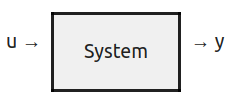
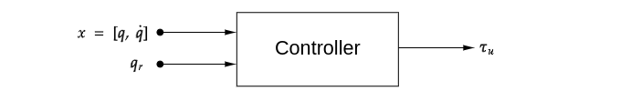
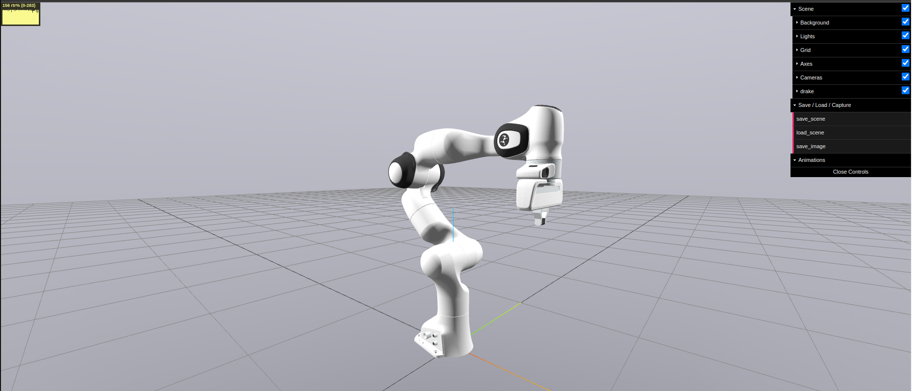

# Modelling dynamical systems
The previous tutorial provided an introduction to adding, viewing, and simulating your robot in Drake. In this tutorial, we will delve deeper into controlling our simulated robot for setpoint regulation **without contact**.

Drake's system modeling approach is inspired by MATLAB's Simulink but without the graphical user interface. It focuses on introspecting the structure of governing equations, allowing for advanced algorithms for analysis, system identification, and feedback or state estimator design. In this tutorial, you will learn how to:

* Write your own controller as a system block.
* Integrate your controller into your simulation.
* Obtain/Compute your system dynamics.
* Examine the equations of motion in manipulator form.

We will be running the tutorial example [tutorial_2b.py](../tutorial_scripts/tutorial_03.py), which can be executed with the command: 
```sh
cd ~/RoboticsII/tutorial_scripts 
python3 ./tutorial_03.py
```

## Adding an existing dynamic block 

## Writing your own dynamics
Before implementing our controller, we need to understand what a `LeafSystem` is. A `LeafSystem` is a class in Drake that provides the basic functionality for a system, including the declaration of the input and output ports of the system. Every user-defined system should derive from the `Drake::Systems::LeafSystem` class. 
<div style="text-align: center;">
    
</div>

<!-- ### Using `SymbolicVectorSystem`
There are various ways to define a leaf system; the simplest approach is using the `SymbolicVectorSystem` class. This class in Drake simplifies the creation of state-space systems using symbolic expressions. Below, we demonstrate how to create a simple continuous-time system using symbolic expressions.
#### Continuous-Time System Example
Consider a continuous-time, nonlinear, input-output dynamical system described by:
$$\dot{x} = x^2 + x, \qquad y = x$$
Here’s how to implement this system in Drake:

```python
from pydrake.symbolic import Variable
from pydrake.systems.primitives import SymbolicVectorSystem

# Define a new symbolic Variable
x = Variable("x")

# Define the System
continuous_vector_system = SymbolicVectorSystem(state=[x], dynamics=[x**2 + x], output=[x])
```
This code  continuous_vector_system variable is now an instantiation of a Drake System class, that can be used in a number of ways, as we will illustrate below. 

**Note:** the `state` argument expects a vector of `symbolic::Variable` (Python lists are automatically converted), while the `dynamics` and `output` arguments expect vectorS of `symbolic::Expressions`.

#### Discrete-Time System Example
If you want to implement a discrete-time system, you can specify the time period of the system. For example, to implement the system described by:
$$x[n+1] = x^2+1, \qquad y[n]=x(n),$$
This system, with zero inputs, one state variable, and one output, can be implemented as follows:
```python
from pydrake.symbolic import Variable
from pydrake.systems.primitives import SymbolicVectorSystem

# Define a new symbolic Variable
x = Variable("x")

# Define the System with a time period
discrete_vector_system = SymbolicVectorSystem(state=[x], dynamics=[x**2 + 1], output=[x], time_period=1.0)
``` -->

### Deriving from `LeafSystem`
There are various ways to define a leaf system; the simplest approach is using the templates provided by Drake, such as `SymbolicVectorSystem` class. This class, for example, simplifies the creation of state-space systems using symbolic expressions. However, for systems with multiple inputs and outputs, mixed discrete and continuous dynamics, hybrid dynamics with guards and resets, constraints, and stochastic systems, a flexible approach is to derive directly from  `Drake::Systems::LeafSystem`.

#### PD controller example
We will use the `LeafSystem` to construct a PD controller with gravity compensation. We will define 2 input ports for our controller block: one for the desired robot state "$q_r$" and another to feedback the state of the robot $q$ and $\dot{q}$. The output of our controller is given as:
$$\tau_u = K_P (q_r - q) - K_D \dot{q} + g(q) ,$$
where $K_P$ and $K_D$ are the proportional and derivative gains, respectively.

The state of a multibody system is given by its generalized positions vector $q$, and its generalized velocities vector $\dot{q}$. Our Panda robot URDF has 9 actuated degrees of freedom corresponding to the 7 revolute joints and 2 prismatic joints (left and right fingers). Thus, we declare our current state input with a size of 18, equal to the state vector provided by the multibody plant of the form $x = [q, \dot{q}]$.
<div style="text-align: center;">
    
</div>

When initializing the controller, we will pass our plant to perform dynamic calculations in a local context. Additionally, we will declare a periodic publisher that reports our system dynamics, as explained below and defined in [below](#inspecting-the-dynamics-the-manipulator-equations).
```python
class Controller(LeafSystem):
    def __init__(self, plant):
        super().__init__()

        # Declare input ports for desired and current states
        self._current_state_port = self.DeclareVectorInputPort(name="Current_state", size=18)
        self._desired_state_port = self.DeclareVectorInputPort(name="Desired_state", size=9)

        # PD+G gains (Kp and Kd)
        self.Kp_ = [120.0, 120.0, 120.0, 100.0, 50.0, 45.0, 15.0, 120, 120]
        self.Kd_ = [8.0, 8.0, 8.0, 5.0, 2.0, 2.0, 2.0, 5, 5]

        # Store plant and context for dynamics calculations
        self.plant, self.plant_context_ad = plant, plant.CreateDefaultContext()

        # Declare discrete state and output port for control input (tau_u)
        state_index = self.DeclareDiscreteState(9)  # 9 state variables.
        self.DeclareStateOutputPort("tau_u", state_index)  # output: y=x.
        self.DeclarePeriodicDiscreteUpdateEvent(
            period_sec=1/1000,  # One millisecond time step.
            offset_sec=0.0,  # The first event is at time zero.
            update=self.compute_tau_u) # Call the Update method defined below.
        
        # Create a periodic event to publish the Dynamics of our robot.
        self.DeclarePeriodicPublishEvent(1, 10, self.PublishDynamics) 
    
    def compute_tau_u(self, context, discrete_state):
        num_positions = self.plant.num_positions()
        num_velocities = self.plant.num_velocities()

        # Evaluate the input ports
        self.q_d = self._desired_state_port.Eval(context)
        self.q = self._current_state_port.Eval(context)

        # Compute gravity forces for the current state
        self.plant_context_ad.SetDiscreteState(self.q)
        gravity = -self.plant.CalcGravityGeneralizedForces(self.plant_context_ad)      
        
        tau = self.Kp_ * (self.q_d - self.q[:num_positions]) - self.Kd_ * self.q[num_positions:] + gravity

        # Update the output port = state
        discrete_state.get_mutable_vector().SetFromVector(tau)
```
<!-- In order to do dynamic computation, such as computing the gravity effect, and  -->
Drake also offers helper classes and methods deriving from or constructing `LeafSystem`, such as `Drake::systems::Primitives::LinearSystem` or the `Drake::Systems::Linearize()` method. In many cases, like simulating robot dynamics and actuators/sensors, most required classes are already implemented. For advanced features of `LeafSystem`, consider reading the [authoring leaf systems tutorial](https://github.com/RobotLocomotion/drake/blob/a913229b6a3fbf2ffa33ecf8a50fc26b176f3ba7/tutorials/authoring_leaf_systems.ipynb).

### Adding system blocks to a diagram
Now having defined our controller, we need to add it to our diagram. We can do this in our `create_sim_scene` function using the `DiagramBuilder` class, as shown below. Additionally, we have defined and connected a `ConstantVectorSource` to feed our desired robot pose to our controller in joint space. And finally, by connecting the system blocks, we can build our simulation scene.
```python
def create_sim_scene(sim_time_step):   
    builder = DiagramBuilder()
    plant, scene_graph = AddMultibodyPlantSceneGraph(builder, time_step=sim_time_step)
    parser = Parser(plant)
    parser.AddModelsFromUrl("file://" + robot_path)
    plant.Finalize()

    # Add visualization to see the geometries in MeshCat
    AddDefaultVisualization(builder=builder, meshcat=meshcat)

    # Add a PD+G controller to regulate the robot
    controller = builder.AddNamedSystem("PD+G controller", Controller(plant))
    
    # Create a constant source for desired positions (Try to change the values!)
    despos_ = [0.0, -0.785, 0.0, -2.356, 0.0, 1.571, 0.785, 0.0, 0.0]
    des_pos = builder.AddNamedSystem("Desired position", ConstantVectorSource(despos_))
    
    # Connect systems: plant outputs to controller inputs, and vice versa
    builder.Connect(plant.get_state_output_port(), controller.GetInputPort("Current_state")) 
    builder.Connect(controller.GetOutputPort("tau_u"), plant.GetInputPort("applied_generalized_force"))
    builder.Connect(des_pos.get_output_port(), controller.GetInputPort("Desired_state"))

    # Build and return the diagram
    diagram = builder.Build()
    return diagram
```
This diagram is then simulated and rendered with the following settings.
```python
# Create a function to run the simulation and save the block diagram:
def run_simulation(sim_time_step):
    diagram = create_sim_scene(sim_time_step)
    simulator = Simulator(diagram)
    simulator.Initialize()
    simulator.set_target_realtime_rate(1.)

    # Save the block diagram as an image file
    svg_data = diagram.GetGraphvizString(max_depth=2)
    graph = pydot.graph_from_dot_data(svg_data)[0]
    image_path = "figures/block_diagram_2b.png"  # Change this path as needed
    graph.write_png(image_path)
    print(f"Block diagram saved as: {image_path}")
    
    # Run simulation and record for replays in MeshCat
    meshcat.StartRecording()
    simulator.AdvanceTo(10.0)  # Adjust this time as needed
    meshcat.PublishRecording()

# Run the simulation with a specific time step. Try gradually increasing it!
run_simulation(sim_time_step=0.001)
```
When running the code, the robot will be simulated and vizsualized in meshcat. if you modified the controller will regulate the robot to the desired pose, as shown in the figure below.
<div style="text-align: center;">
    
</div>
From the rendered block diagram, we can verify our diagram definition by inspecting the port connections:
<div style="text-align: center;">
    
</div>

### Inspecting the dynamics (the manipulator equations)
We can also use Drake to evaluate the dynamics of a given MultibodyPlant in manipulator equations form. 
```python
        def PublishDynamics(self, context, mode='numerical'):
        print("Publishing event")

        # Get current state
        current_state = self._current_state_port.Eval(context)
        q = current_state[:9]
        qdot = current_state[9:]

        if mode == 'numerical':
            # Evaluate the dynamics numerically
            (M, Cv, tauG, B, tauExt) = CalcRobotDynamics(self.plant, q=q, v=qdot)
        elif mode == 'symbolic':
            # Evaluate the dynamics symbolically
            # Symbolic variables for joint positions and velocities
            self.q_sym = MakeVectorVariable(9, "q")
            self.qdot_sym = MakeVectorVariable(9, "qdot")
            (M, Cv, tauG, B, tauExt) = CalcRobotDynamics(self.plant.ToSymbolic(), q=self.q_sym, v=self.qdot_sym)
        else:
            raise ValueError("Invalid mode. Choose 'numerical' or 'symbolic'.")

        print("M = \n" + str(M))
        print("Cv = " + str(Cv))
        print("tau_G = " + str(tauG))
        print("B = " + str(B))
        print("tau_ext = " + str(tauExt))
```
By passing the plant to the `CalcRobotDynamics` function, we can evaluate the dynamics numerically for a particular state of the robot, or symbolically (with floating-point coefficients):
<!-- Drake is also fairly unique in supporting symbolic computation (with floating-point coefficients).  -->
```python
def CalcRobotDynamics(
    plant: MultibodyPlant,
    q: npt.NDArray,
    v: npt.NDArray = None,
    context: Context = None,
):
    """Returns the components of the manipulator equations -- M(q), C(q,v), tauG(q), B(q), and tauExt(q, v) -- for a given MultibodyPlant.

    Args:
        plant: The MultibodyPlant for which to compute the manipulator equations.
        q: The generalized positions.
        v: The generalized velocities.  If None, the velocities are taken from the
           context.
        context: The Context to use for the computation.  If None, a new default
                 Context will be created.
    """
    if context is None:
        context = plant.CreateDefaultContext()
    plant.SetPositions(context, q)
    if v is not None:
        plant.SetVelocities(context, v)
    M = plant.CalcMassMatrixViaInverseDynamics(context)
    Cv = plant.CalcBiasTerm(context)
    tauG = plant.CalcGravityGeneralizedForces(context)
    B = plant.MakeActuationMatrix()
    forces = MultibodyForces_(plant)
    plant.CalcForceElementsContribution(context, forces)
    tauExt = plant.CalcGeneralizedForces(context, forces) - tauG     
    return (M, Cv, tauG, B, tauExt)
```

# Next steps
Now you should be able to write your own system blocks and connect them in your diagram. We also saw that we can compute and obtain the dynamics of a multibody plant, both symbolically and numerically. We will use a similar approach for automatic differentiation, as you will see in the next tutorial.

Additionally, in the next tutorial, we will go further and explore additional simulation settings and contact mechanisms in Drake. So proceed to [03a_solvers.md](./03a_solvers.md).