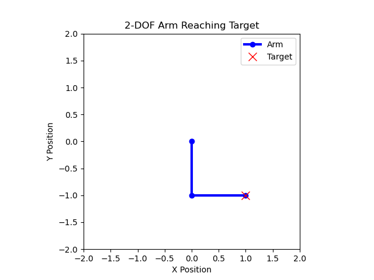

# Mathmatical programming
Many engineering and robotics problems can be formulated as mathematical optimization problems and solved using numerical solvers. A general mathematical optimization problem can be written as:

$$\min_x f(x)$$

subject to:

$$(1) \quad g(x) = 0$$

$$(2) \quad h(x) \leq 0$$

Where $f(x)$ represents the cost function to be minimized, and $g(x)$ and $h(x)$ are equality and inequality constraints, respectively.

The way an optimization problem is solved depends heavily on how it is categorized (Linear Programming, Quadratic Programming, Mixed-Integer Programming, etc.), which is determined by the structure of both the cost function and constraints.

#### Why Use Drake for Mathematical Programming?
Typically, switching between solvers or problem types requires significant code changes. Drake's `MathematicalProgram` class addresses this issue by providing a **unified interface** to set up optimization problems, regardless of which solver you ultimately choose. It allows you to formulate problems involving costs, constraints, and decision variables, without worrying about the solver details. Drake then selects the appropriate solver based on the problem’s structure, though manual solver selection is also supported for finer control.

This tutorial will walk you through setting up and solving an optimization problem for a simple **2-DOF robotic arm**. We'll formulate a mathematical program to minimize joint angles while ensuring the robot's end-effector reaches a target position. This example highlights how to use Drake’s `MathematicalProgram` and visualize the results.

## Problem formulation
Let’s consider a robot with two joints, each represented by an angle $\theta_1$ and $\theta_2$. The task is to move the end-effector of the robot arm to a specified target position, while minimizing the movement effort, represented by the sum of squared joint angles.

The **objective** is to minimize:

$$c = {\theta_1}^2 + {\theta_2}^2$$

This is a proxy for reducing energy consumption since large changes in joint angles are energetically costly.

The **constraints** ensure the end-effector reaches a specific point $(x_{target}, y_{target})$  in the 2D plane. The position of the end-effector is determined by the following kinematic equations:

$$x(\theta_1,\theta_2) = L_1 \cos(\theta_1) + L_2 \cos(\theta_1+\theta_2)$$

$$y(\theta_1,\theta_2) = L_1 \sin(\theta_1) + L_2 \sin(\theta_1+\theta_2)$$

where:
- $L_1$ and $L_2$ are the lengths of the two arm segments.
- $\theta_1$ and $\theta_2$ are the joint angles
- $x_{target}$ and $y_{target}$ are the target coordinates for the end-effector.

## Code implementation
We'll now implement this optimization problem using Drake's `MathematicalProgram`.

First, we import the necessary libraries and define the arm segment lengths and target position.
```Python
from pydrake.solvers import MathematicalProgram, Solve, SnoptSolver
import numpy as np
import matplotlib.pyplot as plt
from matplotlib.animation import FuncAnimation
from IPython.display import display

# Arm segment lengths
L1 = 1.0
L2 = 1.0

# Target position (x, y)
x_target = 1.0
y_target = -1.0
```

### Initialize up the optimization problem
We first initialize an instance of `MathematicalProgram` and define decision variables representing the joint angles of the robot arm.
```Python
# Initialize the optimization problem
prog = MathematicalProgram()

# Decision variables: theta1 and theta2 (joint angles)
theta = prog.NewContinuousVariables(2, "theta")
```
Here, `prog.NewContinuousVariables(2, "theta")` creates two continuous decision variables 
$\theta_1$ and $\theta_2$.

### Adding the cost function
In more complex optimization problems, it is often helpful to express the total cost function $f(x)$ as a sum of individual cost functions, i.e., $f(x) = \sum g_i(x)$. The `AddCost()` function can be used to add these components.

Here, the cost function minimizes the sum of squared joint angles, which acts as a proxy for minimizing energy consumption:
```Python
# Add a cost function: minimize sum of squared joint angles
prog.AddCost(theta[0]**2 + theta[1]**2)
```
This quadratic cost penalizes large deviations in the joint angles, effectively minimizing movement.

### Adding constraints
We now add constraints to ensure the end-effector reaches the desired target position. This is done by constraining the values of $x(\theta_1,\theta_2)$ and $y(\theta_1,\theta_2)$ to match the target coordinates (x_target, y_target).
```Python
# Constraints: arm must reach the target position (x_target, y_target)
x_end = L1 * np.cos(theta[0]) + L2 * np.cos(theta[0] + theta[1])
y_end = L1 * np.sin(theta[0]) + L2 * np.sin(theta[0] + theta[1])

x_constraint = prog.AddConstraint(x_end == x_target)
x_constraint.evaluator().set_description("x_constraint")
y_constraint = prog.AddConstraint(y_end == y_target)
y_constraint.evaluator().set_description("y_constraint")
```
Drake automatically analyzes the type of constraint (e.g., linear or nonlinear) when adding them. In this case, the kinematic equations result in nonlinear equality constraints. Additionally, a tip is to label your constraint when adding them for better readability when rendering or debugging,

### Rendering the problem
We can render the problem formulation in LaTeX to verify that it has been set up correctly.
```Python
from IPython.display import display

# Render the problem in LaTeX format
display(prog.ToLatex())
```

## Solving the problem
Now that the problem is formulated, we can solve it. Drake offers both automatic solver selection and manual solver selection. For a full list of the available solver options check [here](add/later).

#### 1) Automatic solver selection
In most cases, the easiest approach is to let Drake automatically select the appropriate solver based on the problem’s characteristics. This process involves analyzing the types of constraints and costs, which can be computationally expensive for large problems. However, it's convenient when you don't have a preferred solver or when you dont know the type of problem you are solving.
```Python
# Initial guess for joint angles
x_init = np.array([0.5, 0.1])  # Initial guess for theta

# Solve the optimization problem automatically
result = Solve(prog, x_init)
```
After solving, we check if the optimization was successful and retrieve the solution.
```Python
# Check if the optimization found a feasible solution
if result.is_success():
    theta_opt = result.GetSolution(theta)
    print(f"Optimal solution found: theta1 = {theta_opt[0]:.4f}, theta2 = {theta_opt[1]:.4f}")
    
    # Print the optimal cost and solver info
    print(f"Optimal cost: {result.get_optimal_cost():.4f}")
    print(f"Solver used: {result.get_solver_id().name()}")
else:
    print("No solution found")
```

#### 2) Manual solver selection
Alternatively, you can manually select a solver (e.g., SNOPT) for greater control over the optimization process. This can be more efficient for large problems or when you have specific solver preferences.
```Python
# Manual solver selection (SNOPT in this case)
solver = SnoptSolver()
result = solver.Solve(prog, x_init, None)  # Optionally configure solver settings here 
```

Note that solver.Solve() expects three input arguments, the optimization program prog, the initial guess of the decision variable values ([1, 1] in this case), and an optional setting for the solver (None in this case, we use the default SNOPT setting). 

**Note on initial guesses:**  
Some optimization problems, such as nonlinear optimization, require an initial guess. Providing a good initial guess can significantly improve the solver's performance. If no initial guess is provided, Drake will use a zero-valued vector as the default.

**Accessing solver details**  
If you know which solver is used, you can access solver-specific details.
```Python
# Access solver-specific details
if result.is_success():
    solver_details = result.get_solver_details()
    print(f"Solver details: {solver_details}")
```
Each solver has its own details. You should refer to the `SolverDetails` class on what is stored inside the return argument of `result.get_solver_details()`. For example, if you know that Snopt is called, then refer to `SnoptSolverDetails` class; for IPOPT solver, refer to `IpoptSolverDetails`, etc.

**Recommendation:** If you know the type of problem and have a preferred solver, it's advisable to manually select it to avoid the overhead of automatic solver selection.


## Callbacks and visualization
Some solvers support adding a **callback function** that is executed at each iteration. This is particularly useful for visualization or monitoring the progress of the solver.

Here, we’ll use a callback to store intermediate solutions and create an animation of the robot arm reaching the target position.

```Python
# Storage for intermediate solutions
trajectory = []

# Callback to store joint angles during optimization
def store_arm_position(theta_vals):
    trajectory.append(np.copy(theta_vals))

# Add the callback to the program
prog.AddVisualizationCallback(store_arm_position, theta)
```
After solving the problem, we can create an animation to visualize the arm's movement towards the target position.
```Python
import matplotlib.pyplot as plt
from matplotlib.animation import FuncAnimation

# Create a figure and axis for plotting
fig, ax = plt.subplots()
ax.set_xlim(-2, 2)
ax.set_ylim(-2, 2)
ax.set_aspect('equal', adjustable='box')
ax.set_title("2-DOF Arm Reaching Target")
ax.set_xlabel("X Position")
ax.set_ylabel("Y Position")

# Initial plot elements
arm_line, = ax.plot([], [], 'o-', lw=3, color='b', label='Arm')  # Blue arm
target_plot, = ax.plot(x_target, y_target, 'rx', markersize=10, label='Target')  # Red target point

# Update function for the animation
def update(frame):
    theta_vals = trajectory[frame]
    # Calculate joint positions
    x0, y0 = 0, 0  # Base position
    x1 = L1 * np.cos(theta_vals[0])
    y1 = L1 * np.sin(theta_vals[0])
    x2 = x1 + L2 * np.cos(theta_vals[0] + theta_vals[1])
    y2 = y1 + L2 * np.sin(theta_vals[0] + theta_vals[1])
    
    # Update arm position in plot
    arm_line.set_data([x0, x1, x2], [y0, y1, y2])
    return arm_line, target_plot

# Create the animation
ani = FuncAnimation(fig, update, frames=len(trajectory), interval=200, blit=True, repeat=False)

plt.legend()
plt.show()
```
The animation shows the arm moving from its initial configuration to the position where the end-effector reaches the target point while minimizing the joint angles. This visual feedback can be invaluable for understanding the behavior of the optimization algorithm.
<div style="text-align: center;">
    
</div>

## Additional Notes
### Automatic vs. Manual Solver Selection
- Automatic Selection: Convenient but may introduce overhead due to problem analysis.
- Manual Selection: More efficient if you know the problem type and suitable solver.

### Solver Parameters
For more advanced usage, you can configure solver-specific parameters. For example, you can set options for convergence tolerances or iteration limits. Refer to the Drake documentation for details on solver parameters.

### Accessing Solver Details
Each solver provides specific details that can be accessed for debugging or analysis. For instance, if using IPOPT, you can access the solver's status code:
```Python
if result.get_solver_id().name() == "Ipopt":
    status = result.get_solver_details().status
    print(f"Ipopt solver status: {status}")
```
Refer to the solver's documentation for the available details.

### Constraint Types
Drake supports various types of constraints, including:
- Linear Constraints
- Nonlinear Constraints
- Bounding Constraints

Understanding the nature of your constraints helps in selecting appropriate solvers and formulating the problem efficiently.

# Advanced tutorials by Drake:
- [Setting solver parameters](https://github.com/RobotLocomotion/drake/blob/4ac314f3c05c10171fc7831c2088f5290a5f9d52/tutorials/solver_parameters.ipynb)
- [Updating costs and constraints (e.g. for efficient solving of many similar programs)](https://github.com/RobotLocomotion/drake/blob/4ac314f3c05c10171fc7831c2088f5290a5f9d52/tutorials/updating_costs_and_constraints.ipynb)
- [Debugging tips](https://github.com/RobotLocomotion/drake/blob/4ac314f3c05c10171fc7831c2088f5290a5f9d52/tutorials/debug_mathematical_program.ipynb)
- [Linear program](https://github.com/RobotLocomotion/drake/blob/4ac314f3c05c10171fc7831c2088f5290a5f9d52/tutorials/linear_program.ipynb)
- [Quadratic program](https://github.com/RobotLocomotion/drake/blob/4ac314f3c05c10171fc7831c2088f5290a5f9d52/tutorials/quadratic_program.ipynb)
- [Nonlinear program](https://github.com/RobotLocomotion/drake/blob/4ac314f3c05c10171fc7831c2088f5290a5f9d52/tutorials/nonlinear_program.ipynb)
- [Sum-of-squares optimization](https://github.com/RobotLocomotion/drake/blob/4ac314f3c05c10171fc7831c2088f5290a5f9d52/tutorials/sum_of_squares_optimization.ipynb)


# WIll be moved/removed???
---------------------------------------
--------------
--------------
--------------
--------------
--------------
# Trajectory optimization
The systems framework and the optimization framework share a common core of templatized scalar types to support automatic differentiation and symbolic computation. Perhaps the best way to illustrate the power of this is through an example: the direct trajectory optimization code. We can easily set up a trajectory optimization problem by handing it as a system (which can be an entire diagram), and then adding costs and constraints. If the system happens to have linear state dynamics, and the costs and constraints are all convex, then the trajectory optimizer will automatically dispatch the problem to a high-performance convex optimization library. If not, the optimizer will dispatch to a more generic nonlinear solver automatically.
## Methods and classes
transcriptions of trajectory optimization,


<https://stackoverflow.com/questions/72146203/linear-model-predictive-control-optimization-running-slowly>

trajectory optimization:

<https://stackoverflow.com/questions/66457129/workflow-for-through-contact-trajectory-optimization-in-drake>


# Working with automatic differentiation
to take derivatives with respect to one of the bodies' masses:
```python
# ... Code to add bodies, finalize plant, and to obtain a
# context and a body's spatial inertia M_BBo_B.
# Scalar convert the plant.
plant_autodiff = plant.ToAutoDiffXd()
context_autodiff = plant_autodiff.CreateDefaultContext();
context_autodiff.SetTimeStateAndParametersFrom(context);
body = plant_autodiff.GetRigidBodyByName("panda_hand");
# Modify the body parameter for mass.
mass_autodiff(mass, Vector1d(1));
body.SetMass(context_autodiff.get(), mass_autodiff);
# M_autodiff(i, j).derivatives()(0), contains the derivatives of
# M(i, j) with respect to the body's mass.
M_autodiff(plant_autodiff.num_velocities(),    plant_autodiff.num_velocities());
plant_autodiff.CalcMassMatrix(context_autodiff, M_autodiff);
```

For more information on using AutoDiff in Drake, refer to these resources:
https://stackoverflow.com/questions/67983497/how-to-use-autodifftogradientmatrix-to-solve-for-coriolis-matrix-in-drake
https://stackoverflow.com/questions/61734446/can-we-cache-equations-in-symbolic-form-and-plug-in-numbers-during-trajectory-op?noredirect=1&lq=1

Example: https://deepnote.com/app/jeh15/Drake-Tutorial-Modeling-Systems-59e84db9-b9b5-42c4-a84f-11763ed115df


[https://stackoverflow.com/questions/78484746/quadrotor-simulation-with-mpc-controller-get-stuck-in-drake](https://stackoverflow.com/questions/78484746/quadrotor-simulation-with-mpc-controller-get-stuck-in-drake)

https://drake.mit.edu/doxygen_cxx/group__multibody__solvers.html 
Drake has a method "CreateDefaultContext()" to create the context
with default values for all the subsystems. Values in the context, such
as the initial state and the initial time, can also be
independently set before the simulation begins.

Simulation: For dynamic simulation, Drake exposes a Lego block interface
for building complex systems out of smaller pieces, a paradigm similar
to Simulink and other modeling software. Objects possess input and
output ports. One wires up input ports to output ports to build
composite systems.

To build a simple forward simulation, construct a builder object. Then
add all subsystems to the builder object. Explicitly connected input and
output ports together. One possible cause of crashes may be leaving
ports unconnected. 

Once the entire system has been built, a Simulator object can be
constructed from it. You may select an integration scheme and set
initial conditions by getting a context from the Simulator object. The
context holds state information. 
