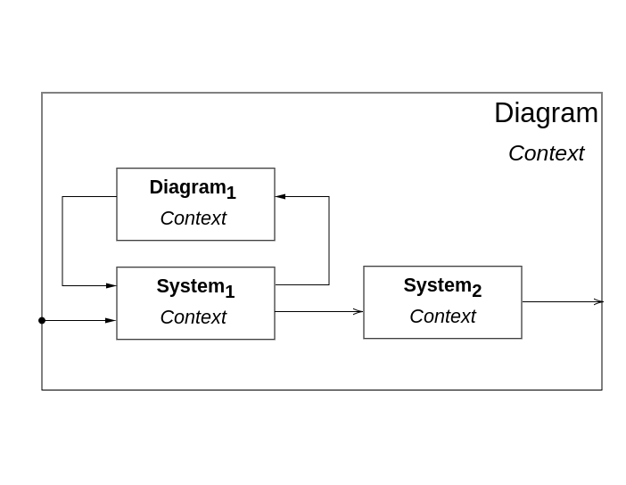

# Trajectory Planning with PyDrake

In the previous tutorials, we explored modeling, dynamics, and control of robotic manipulators in Drake.  
In this tutorial, we will build upon those foundations to **generate feasible trajectories** for our robot — from simple end-effector positioning to full motion planning in cluttered environments.

You will learn how to:

* Solve **inverse kinematics (IK)** problems to reach desired Cartesian poses.  
* Design **primitive paths** (e.g., line and arc segments) in task space.  
* Convert discrete waypoints into **smooth time-parameterized trajectories** (e.g., trapezoidal or S-curve).  
* Integrate **obstacle-aware motion planning** using the OMPL framework.  

We will progressively develop four tutorial scripts:
```bash
cd ~/Robotics-II/tutorial_scripts
python3 tutorial_inverse_kinematics.py
python3 tutorial_primitive_path.py
python3 tutorial_trajectory_generation.py
python3 tutorial_path_planning.py
```

---

## 1. Inverse Kinematics (IK)

Inverse kinematics finds a joint configuration $\mathbf{q}$ that positions the robot’s end effector at a desired Cartesian pose $T_\text{goal}$ (position + orientation).  
Drake’s `InverseKinematics` class provides a flexible way to define pose constraints, joint limits, and even soft costs.

### Example: reaching a Cartesian target
We begin with a simple problem: move the Panda end effector to a desired target point in 3D.

```python
from pydrake.all import (
    MultibodyPlant, Parser, InverseKinematics, RigidTransform,
    RotationMatrix, Solve
)
import numpy as np

plant = MultibodyPlant(time_step=0.0)
Parser(plant).AddModelsFromUrl("package://franka_description/urdf/panda_arm.urdf")
plant.Finalize()
context = plant.CreateDefaultContext()

# Define target pose (position + orientation)
target_position = np.array([0.5, 0.0, 0.4])
target_orientation = RotationMatrix.MakeXRotation(np.pi)  # flipped orientation
target_pose = RigidTransform(target_orientation, target_position)

# Create inverse kinematics problem
ik = InverseKinematics(plant)
q = ik.q()

ee_frame = plant.GetFrameByName("panda_link8")

# Add position and orientation constraints
ik.AddPositionConstraint(ee_frame, [0, 0, 0], plant.world_frame(),
                         target_position - 1e-3, target_position + 1e-3)
ik.AddOrientationConstraint(
    ee_frame, RotationMatrix(), plant.world_frame(),
    target_orientation, np.deg2rad(1)
)

# Solve
result = Solve(ik.prog())
if result.is_success():
    q_sol = result.GetSolution(q)
    print("IK success! Joint positions:", q_sol)
else:
    print("IK failed to find a solution.")
```

This minimal example demonstrates how to formulate and solve an IK problem.  
Try varying the `target_position` or `target_orientation` to see how the solution changes.

<div style="text-align: center;">
    
</div>

---

## 2. Primitive Path Planning

Once we can reach a Cartesian point, we can plan **continuous motion** between two points.  
A *primitive path* is a geometric curve parameterized by distance, such as a **line** or **arc**.  
We can sample points along these curves and solve IK at each point to generate a joint-space path.

### Example: straight-line motion in task space

```python
import numpy as np

def generate_line_path(start, goal, num_points=20):
    """Generate linearly interpolated positions between start and goal."""
    return np.linspace(start, goal, num_points)

start = np.array([0.4, -0.2, 0.3])
goal = np.array([0.6, 0.2, 0.5])
path_points = generate_line_path(start, goal, 25)
```

We can then compute IK for each path point and record the resulting joint trajectory:

```python
joint_traj = []
for p in path_points:
    target_pose = RigidTransform(RotationMatrix.MakeXRotation(np.pi), p)
    ik = InverseKinematics(plant)
    ik.AddPositionConstraint(ee_frame, [0,0,0], plant.world_frame(), p - 1e-3, p + 1e-3)
    result = Solve(ik.prog())
    if result.is_success():
        joint_traj.append(result.GetSolution(q))
```

Plotting or visualizing these joint states in MeshCat will show the end effector smoothly tracing the line segment.

<div style="text-align: center;">
    
</div>

You can easily extend this to circular arcs by parameterizing the motion as:

```python
theta = np.linspace(0, np.pi/2, num_points)
arc = np.column_stack([
    0.5 + 0.1*np.cos(theta),
    0.0 + 0.1*np.sin(theta),
    np.full_like(theta, 0.4)
])
```

---

## 3. Trajectory Generation

Now that we have discrete waypoints, we must generate a **smooth time-based trajectory**  
that can be followed by a controller or simulator. Drake provides several utilities for this:

* `PiecewisePolynomial.FirstOrderHold()` — linear interpolation between samples.  
* `PiecewisePolynomial.CubicShapePreserving()` — smooth cubic spline with monotonicity.  
* Custom trapezoidal or S-curve velocity profiles for industrial motion planning.

### Example: trapezoidal velocity profile

```python
from pydrake.all import PiecewisePolynomial

waypoints = np.array([0.0, 0.2, 0.5, 0.8, 1.0])
times = np.array([0, 1, 2, 3, 4])
traj = PiecewisePolynomial.FirstOrderHold(times, waypoints.reshape(1,-1))

# Evaluate at t=1.5
print("Position:", traj.value(1.5))
print("Velocity:", traj.derivative().value(1.5))
```

### Multi-DOF joint trajectory

We can extend this to multiple joints:

```python
waypoints = np.array([
    [0.0, 0.0, 0.0, 0.0],
    [0.3, 0.2, -0.1, 0.4],
    [0.6, 0.3, -0.2, 0.8]
]).T
times = [0.0, 1.0, 2.0]
joint_traj = PiecewisePolynomial.CubicShapePreserving(times, waypoints, zero_end_point_derivatives=True)
```

You can then feed this `joint_traj` into a controller block in a simulation, e.g. your PD+G controller, to track the trajectory.

<div style="text-align: center;">
    
</div>

---

## 4. Path Planning with OMPL

The previous approaches assume an obstacle-free environment.  
In realistic scenes, we must plan **collision-free trajectories**.  
Drake provides bindings for the **OMPL** (Open Motion Planning Library) framework, allowing you to integrate sampling-based planners (RRT, PRM, etc.).

### Example: OMPL motion planning

```python
from pydrake.all import (
    SceneGraph, AddMultibodyPlantSceneGraph,
    Parser, MeshcatVisualizerCpp, Simulator
)
from ompl import base as ob, geometric as og

def plan_with_ompl():
    plant, scene_graph = AddMultibodyPlantSceneGraph(MultibodyPlant(0.0))
    Parser(plant).AddModelsFromUrl("package://franka_description/urdf/panda_arm.urdf")
    plant.Finalize()

    # Define the configuration space bounds (joint limits)
    space = ob.RealVectorStateSpace(7)
    bounds = ob.RealVectorBounds(7)
    bounds.setLow(-2.9)
    bounds.setHigh(2.9)
    space.setBounds(bounds)

    # Define start and goal configurations
    start = ob.State(space)
    goal = ob.State(space)
    for i, q in enumerate([0, -1, 0, -2, 0, 1, 0]):
        start[i] = q
    for i, q in enumerate([0.4, -0.5, 0, -2.2, 0, 1.2, 0.4]):
        goal[i] = q

    si = ob.SpaceInformation(space)
    pdef = ob.ProblemDefinition(si)
    pdef.setStartAndGoalStates(start, goal)

    planner = og.RRTConnect(si)
    planner.setProblemDefinition(pdef)
    planner.setup()

    if planner.solve(5.0):
        path = pdef.getSolutionPath()
        print("Found path with", path.getStateCount(), "states")
    else:
        print("No path found.")
```

This snippet sets up a minimal OMPL motion planner for the Panda arm.  
In a full Drake pipeline, you would integrate collision checking using `SceneGraph` geometries.

<div style="text-align: center;">
    
</div>

---

## Summary

| Concept | Tool | Purpose |
|----------|------|----------|
| Inverse Kinematics | `InverseKinematics` | Reach Cartesian goals |
| Primitive Path | Geometric interpolation | Define simple Cartesian paths |
| Trajectory Generation | `PiecewisePolynomial`, Trapezoidal / S-curve | Time-parameterize waypoints |
| Path Planning | OMPL (e.g., RRT, PRM) | Avoid obstacles and collisions |

Each method progressively increases in complexity and capability.  
Together, they form the foundation of **modern motion planning** pipelines for robotic manipulators.

---

## Next steps
In the next tutorial, we will integrate these planning components into a **simulation loop** with feedback control, allowing the robot to track and execute trajectories in real time while avoiding obstacles.
