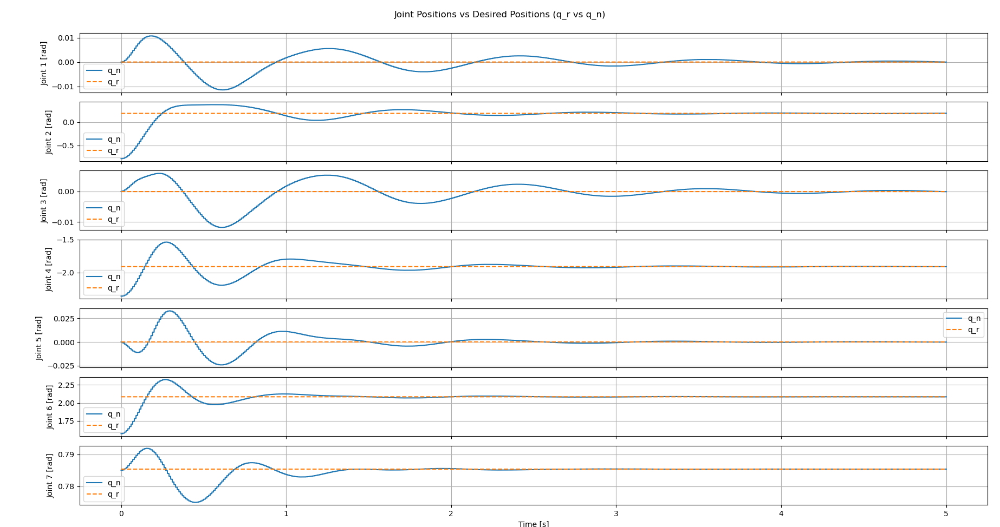
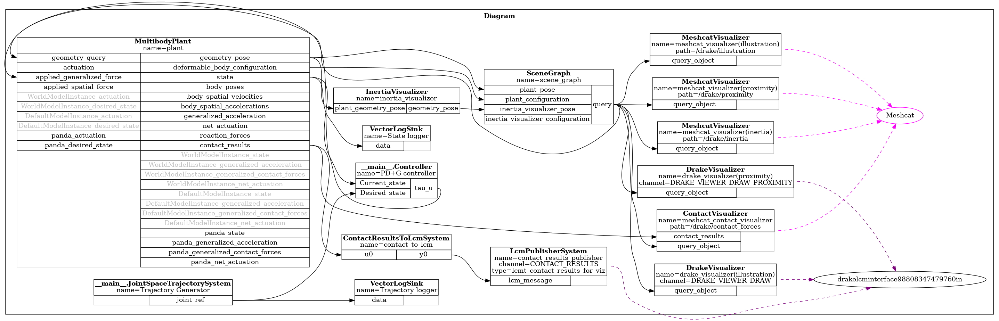
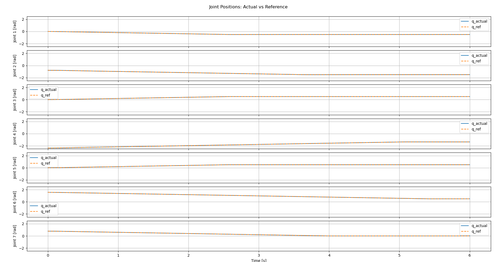
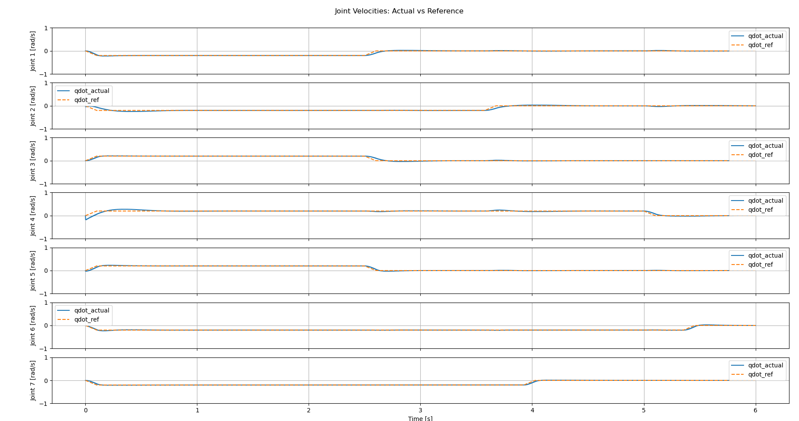
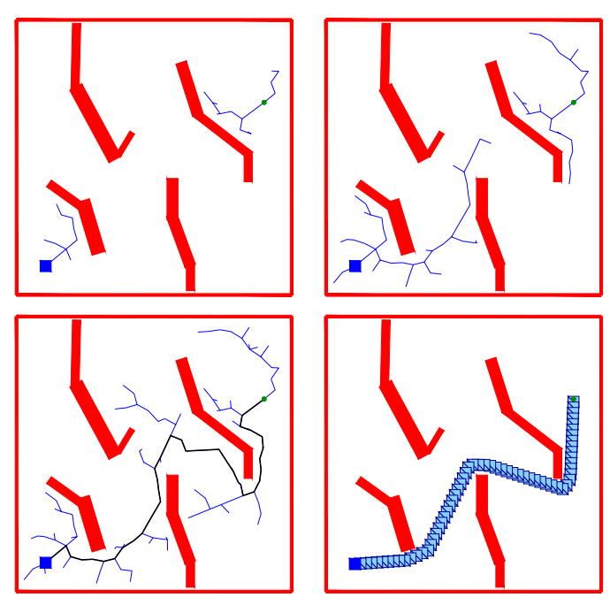

# Trajectory and Path Planning in PyDrake

In the previous tutorial, we developed a PD+G controller to regulate the robot to a desired configuration.  
In this tutorial, we take a major step forward: **planning and following trajectories**.  
We will explore three key concepts:

1. **Inverse Kinematics (IK):** Computing a single target configuration (`q_target`) that achieves a desired end-effector pose.  
2. **Trapezoidal Trajectories:** Generating smooth, time-parameterized joint-space trajectories between configurations.  
3. **OMPL Path Planning:** Computing collision-free paths using sampling-based planners.

By the end of this tutorial, you will be able to:
* Compute target configurations using PyDrake’s `InverseKinematics`.
* Generate and execute time-based trapezoidal joint trajectories.
* Integrate OMPL with Drake for collision-free motion planning.

We will execute three example scripts:

```bash
cd ~/Robotics-II/tutorial_scripts
python3 ./tutorial_04_ik.py
python3 ./tutorial_04_traj.py
python3 ./tutorial_04_path_planner.py
```

---

## 1. Inverse Kinematics — Generating a Target Configuration

### 1.1 Concept
Inverse kinematics (IK) computes the joint configuration `q_target` that achieves a desired **end-effector pose**.  
For the Panda robot, the pose is defined by the position and orientation of the frame `"panda_hand"` in the world frame.

The inverse kinematics (IK) problem aims to find the joint configuration  $\mathbf{q}$ that places the robot’s end-effector at a desired position and orientation in space while keeping the joints within their physical limits. To achieve this, we formulate an optimization problem that minimizes the distance from a nominal or “comfortable” configuration $\mathbf{q}_{\text{nominal}}$, subject to geometric constraints on the end-effector and bounds on the joints. The cost function $(\mathbf{q} - \mathbf{q}_{\text{nominal}})^{\top} W (\mathbf{q} - \mathbf{q}_{\text{nominal}})$ penalizes large joint deviations, where $W$ is a weighting matrix that controls the relative importance of each joint. The position constraint enforces that the end-effector’s Cartesian coordinates match a desired target point, and the orientation constraint limits the angular deviation between the current and desired orientations to within a small tolerance. Finally, lower and upper joint limits $\mathbf{q}_{\min}$ and $\mathbf{q}_{\max}$ are imposed to ensure feasibility. The solution of this problem, $\mathbf{q}_{\text{target}}$, provides a physically valid configuration that realizes the requested end-effector pose and can be directly used by the controller.


In optimization form, the IK problem can be expressed as:

```math
\begin{aligned}
\min_{q}\;& \| q - q_{\text{nominal}} \|^2_W \\
\text{s.t.}\;& f_{\text{position}}(q) = p_{\text{desired}} \\
& f_{\text{orientation}}(q) = R_{\text{desired}} \\
& q_{\min} \le q \le q_{\max}
\end{aligned}
```

The cost function plays a crucial role in ensuring that the solution of the inverse kinematics (IK) problem is not only feasible but also desirable from a practical and numerical standpoint. In the optimization formulation, the quadratic cost 

```math
\begin{aligned}
J(\text{q}) = (\text{q} - \text{q}_{\text{nominal}})^{\top} 
W (\text{q} - \text{q}_{\text{nominal}})
\end{aligned}
```

penalizes large deviations of the joint configuration $\mathbf{q}$ from a reference configuration $\mathbf{q}_{\text{nominal}}$. This reference, often called the $\emph{nominal pose}$, is typically chosen to be a comfortable or neutral configuration of the robot, such as its home or ready position.

By minimizing this cost, we bias the optimization toward solutions that are as close as possible to $\mathbf{q}_{\text{nominal}}$ while still satisfying the end-effector constraints. This has several important benefits:

1. It prevents the solver from selecting extreme or awkward joint angles when multiple IK solutions exist (e.g., elbow-up vs.\ elbow-down postures).
2. It improves numerical stability by providing a well-conditioned and smooth objective function, helping the optimizer converge more reliably.
3. It ensures continuity between successive IK solutions when the target pose changes slightly, leading to smoother overall motion in practice.

In summary, the cost function introduces a preference for “natural” and physically reasonable joint configurations, ensuring that the resulting solution $\mathbf{q}_{\text{target}}$ is both feasible and close to the robot’s typical working region.

### 1.2 Implementation Overview
Drake’s [InverseKinematics](https://drake.mit.edu/doxygen_cxx/classdrake_1_1multibody_1_1_inverse_kinematics.html) class provides a convenient interface to set these constraints and solve the problem using [Solve()](https://drake.mit.edu/doxygen_cxx/namespacedrake_1_1solvers.html#a07bf1722e3e347d7878ae44be98b4b92). In [tutorial_04_ik.py](../tutorial_scripts/tutorial_04_ik.py), the function `solve_ik()` defines and solves the IK problem:

```python
ik = InverseKinematics(plant, context)

# Set nominal joint positions to current positions
q_nominal = plant.GetPositions(context).reshape((-1, 1))


# Constrain position and orientation
# Position constraint
p_AQ = X_WE_desired.translation().reshape((3, 1))
ik.AddPositionConstraint(
    frameB=frame_E,
    p_BQ=np.zeros((3, 1)),
    frameA=plant.world_frame(),
    p_AQ_lower=p_AQ,
    p_AQ_upper=p_AQ
)

# Orientation constraint
theta_bound = 1e-2  # radians
ik.AddOrientationConstraint(
    frameAbar=plant.world_frame(),      # world frame
    R_AbarA=X_WE_desired.rotation(),    # desired orientation
    frameBbar=frame_E,                  # end-effector frame
    R_BbarB=RotationMatrix(),           # current orientation
    theta_bound=theta_bound             # allowable deviation
)
```

A quadratic cost penalizes deviation from a nominal configuration:

```python
# Access the underlying MathematicalProgram to add costs and constraints manually.
prog = ik.prog()
q_var = ik.q()  # decision variables (joint angles)
# Add a quadratic cost to stay close to the nominal configuration:
#   cost = (q - q_nominal)^T * W * (q - q_nominal)
W = np.identity(q_nominal.shape[0])
prog.AddQuadraticErrorCost(W, q_nominal, q_var)

# Enforce joint position limits from the robot model.
lower = plant.GetPositionLowerLimits()
upper = plant.GetPositionUpperLimits()
prog.AddBoundingBoxConstraint(lower, upper, q_var)


# Solve the optimization problem using Drake’s default solver.
# The initial guess is the nominal configuration (q_nominal).
result = Solve(prog, q_nominal)
```

Once solved, the resulting `q_target` is passed to a `ConstantVectorSource` feeding the PD+G controller.

### 1.3 Running the Simulation
```bash
python3 ./tutorial_04_ik.py
```

You will see the robot move its end-effector to the desired target pose defined as:

```python
X_WE_desired = RigidTransform(
    RollPitchYaw(np.pi, 0, 0),
    [0.6, 0.0, 0.4]
)
```

The controller regulates the robot to the computed configuration, as shown below.

<div style="text-align:center;">
  
  <p><em>Figure 1 – Robot reaching target pose computed via inverse kinematics.</em></p>
</div>

### 1.4 Exercises
* Change the target position in `X_WE_desired` and re-run.
* Relax `theta_bound` to 0.1 and observe how orientation accuracy changes.

---

## 2. Trapezoidal Joint-Space Trajectories

### 2.1 Concept
Trajectory generation is a fundamental component of robot motion planning, 
bridging the gap between high-level path planning and low-level control. 
While path planning determines $\emph{where}$ the robot should move (i.e., the 
sequence of desired configurations), trajectory generation determines 
$\emph{how}$ the robot should move in time. It specifies the time evolution of 
each joint position, velocity, and acceleration in a smooth and dynamically 
feasible manner. Without a properly designed trajectory, even a collision-free 
path could result in jerky, unstable, or physically infeasible motions that 
violate actuator limits or cause vibrations and excessive torques.

A common and computationally efficient approach is to use a 
$\textbf{trapezoidal velocity profile}$, which defines the motion of each joint 
as a sequence of three phases: acceleration, constant velocity, and 
deceleration. For a single joint moving from an initial position $q_0$ to a 
final position $q_f$ with a maximum velocity $v_{\max}$ and acceleration 
$a_{\max}$, the displacement is $\Delta q = q_f - q_0$. The trajectory is 
designed such that the joint accelerates at a constant rate $a_{\max}$ until 
it reaches $v_{\max}$, moves at this constant velocity for a period of time, 
and then decelerates symmetrically with $-a_{\max}$ to stop precisely at $q_f$.

Mathematically, the joint position $q(t)$ and velocity $\dot{q}(t)$ over time 
are given by:
```math
\begin{aligned}
q(t) =
\begin{cases}
q_0 + \tfrac{1}{2} a_{\max} t^2, & 0 \le t < t_{\text{acc}} \\[6pt]
q_0 + \tfrac{1}{2} a_{\max} t_{\text{acc}}^2 + v_{\max}(t - t_{\text{acc}}),
& t_{\text{acc}} \le t < t_{\text{acc}} + t_{\text{flat}} \\[6pt]
q_f - \tfrac{1}{2} a_{\max} (T - t)^2, & t_{\text{acc}} + t_{\text{flat}} \le t \le T
\end{cases}
\end{aligned}
```
```math
\begin{aligned}

\dot{q}(t) =
\begin{cases}
a_{\max} t, & 0 \le t < t_{\text{acc}} \\[6pt]
v_{\max}, & t_{\text{acc}} \le t < t_{\text{acc}} + t_{\text{flat}} \\[6pt]
a_{\max} (T - t), & t_{\text{acc}} + t_{\text{flat}} \le t \le T
\end{cases}
\end{aligned}
```

Here, $t_{\text{acc}} = v_{\max}/a_{\max}$ is the acceleration time, 
$t_{\text{flat}}$ is the duration of constant velocity, and 
$T = 2t_{\text{acc}} + t_{\text{flat}}$ is the total motion time. 
If the motion distance $\Delta q$ is too small for the joint to reach 
$v_{\max}$ before decelerating, the trajectory becomes $\emph{triangular}$, 
meaning the acceleration and deceleration phases overlap, and the velocity 
never saturates at $v_{\max}$.

This piecewise-defined trajectory ensures continuous and smooth profiles 
for both $q(t)$ and $\dot{q}(t)$ while respecting joint velocity and 
acceleration limits. The trapezoidal profile is therefore widely used in 
industrial robotics due to its simplicity, deterministic timing, and ability 
to generate smooth, dynamically consistent joint trajectories suitable for 
real-time control.


### 2.2 Implementation
The class `JointSpaceTrajectorySystem` in [tutorial_04_traj.py](../tutorial_scripts/tutorial_04_traj.py) generates the reference signals:

```python
class JointSpaceTrajectorySystem(LeafSystem):
    def __init__(self, q_start, q_goal, v_max, a_max):
        ...
        self._compute_profiles()
        self.DeclareVectorOutputPort("joint_ref", BasicVector(2*self.n), self._output_reference)
```

The method `_compute_profiles()` precomputes motion parameters for each joint:

```python
t_acc = v / a
if dq_abs < a * t_acc**2:
    # Triangular profile
    t_acc = np.sqrt(dq_abs / max(a, 1e-9))
    t_flat = 0.0
else:
    # Trapezoidal profile
    t_flat = (dq_abs - a * t_acc**2) / max(v, 1e-9)
T_trap = 2 * t_acc + t_flat
```

At runtime, `_output_reference()` evaluates \( $q(t)$ \) and \( $\dot{q}(t)$ \) for each joint and outputs them as `[q_ref, qd_ref]`.

The reference is connected to the controller’s desired state input:

```python
builder.Connect(traj_system.get_output_port(0), controller.GetInputPort("Desired_state"))
```

The controller computes:

```math
\begin{aligned}
\boldsymbol{\tau}_u = K_P(\mathbf{q}_r - \mathbf{q}) + K_D(\dot{\mathbf{q}}_r - \dot{\mathbf{q}}) + \mathbf{g}(\mathbf{q})
\end{aligned}
```

<div style="text-align:center;">
  
  <p><em>Figure 2 – Diagram showing the trajectory generator connected to the PD+G controller.</em></p>
</div>

### 2.3 Simulation
```bash
python3 ./tutorial_04_traj.py
```

The output includes two plots:
- Joint positions (actual vs reference)
- Joint velocities (actual vs reference)

<div style="text-align:center;">
  
  <p><em>Figure 3 – Trapezoidal joint trajectory tracking in simulation.</em></p>
</div>

<div style="text-align:center;">
  
  <p><em>Figure 4 – Trapezoidal joint velocity trajectory tracking in simulation.</em></p>
</div>

### 2.4 Exercises
* Modify `v_max` and `a_max` values in the script and observe the duration change.
* Create a triangular trajectory by reducing the displacement between start and goal.
* Integrate the inverse kinematics (IK) solver with the trajectory generator so that, given a desired Cartesian position and orientation, the robot computes the corresponding joint configuration and follows a smooth, time-parameterized trapezoidal trajectory to reach it.

---

## 3. OMPL Path Planning — Collision-Free Motion


### 3.1 Concept

Up to this point, the robot has been operating in an empty workspace, where the motion from one configuration to another could be achieved using simple interpolation or trapezoidal trajectories.  
However, in realistic environments, robots must navigate around obstacles such as tables, tools, or other robots.  
To safely reach a goal configuration without collisions, we need a **path planner** that searches for a sequence of feasible configurations in the robot’s **configuration space (C-space)**.

The [**Open Motion Planning Library (OMPL)**](https://ompl.kavrakilab.org/) is a widely used, open-source framework that implements a large variety of state-of-the-art path planning algorithms, such as:
- **RRT (Rapidly-exploring Random Tree)** and **RRT-Connect**,  
- **PRM (Probabilistic Roadmap)**,  
- **RRT\*** (asymptotically optimal variant), and  
- several planners for kinodynamic and multi-query problems.

OMPL focuses purely on the *geometric* aspects of planning — finding a feasible or optimal path from a start to a goal configuration while avoiding obstacles.  
It does not depend on a specific robot model or simulator; instead, users provide interfaces for:
1. The **state space** (e.g., the robot’s joint positions).  
2. The **state validity checker**, which determines whether a given configuration is collision-free.  
3. The **start** and **goal** states, and optionally, the **distance metric** and **interpolation methods**.

In this tutorial, OMPL is integrated with **Drake’s geometry engine**, which provides efficient collision checking through signed distance queries.  
This allows OMPL to explore only those configurations that are valid within Drake’s current simulation environment.

---

### 3.2 Overview of Configuration Space (C-space)

The robot’s **configuration space** \( $\mathcal{C}$ \) is defined by all possible joint configurations \( $\mathbf{q} \in \mathbb{R}^n$ \), where \( n \) is the number of joints.  
Each point in this space represents a unique posture of the robot.  
Some configurations cause collisions with obstacles or violate joint limits — these are called **invalid** configurations.  
The remaining configurations define the **collision-free subspace**, denoted as \( $\mathcal{C}_{\text{free}}$ \):

```math
\begin{aligned}
\mathcal{C}_{\text{free}} = 
\{ \mathbf{q} \in \mathcal{C} \;|\; 
\text{robot at configuration } \mathbf{q} \text{ is collision-free} \}
\end{aligned}
```

The goal of path planning is to find a **continuous path**  
\( $\pi: [0,1] \to \mathcal{C}_{\text{free}}$ \)  
such that:

```math
\begin{aligned}
\pi(0) = \mathbf{q}_{\text{start}}, 
\qquad 
\pi(1) = \mathbf{q}_{\text{goal}}.
\end{aligned}
```

The resulting path \( $\pi(s)$ \) is a sequence of intermediate, collision-free configurations that connect the start and goal without intersecting any obstacles.

<div style="text-align:center;">
  
  <p><em>Figure 5 – <a href="https://www.cs.cmu.edu/afs/cs/academic/class/15494-s12/readings/kuffner_icra2000.pdf">
  RRT-Connect - Sampling-based path planning in configuration space</a>.</em></p>
</div>
---

### 3.3 Why Sampling-Based Planners?

For high-dimensional manipulators like the Panda robot (\( n = 7 \) revolute + 2 prismatic joints),  
the configuration space is **nonlinear** and **nonconvex**.  
Analytical path planning (e.g., solving for all collision-free trajectories algebraically) is computationally intractable.  
Instead, **sampling-based motion planners** such as RRT and PRM use random sampling to efficiently explore feasible regions of \( $\mathcal{C}$ \):

- **RRT (Rapidly-exploring Random Tree)** incrementally builds a tree rooted at the start configuration, expanding toward random samples to quickly cover the space.
- **RRT-Connect**, a bidirectional variant, grows two trees (from start and goal) and attempts to connect them, greatly reducing computation time.
- **PRM (Probabilistic Roadmap)** samples random configurations, connects nearby samples that are collision-free, and builds a graph used to find paths between configurations.

These methods are **probabilistically complete**, meaning they are guaranteed to find a path if one exists (given enough time and samples).  
They are particularly well-suited for complex robot geometries and environments where traditional grid or graph search would be infeasible.

---

### 3.4 Integrating OMPL with Drake

In this tutorial, the integration between OMPL and Drake is implemented through the `MotionProfile` class.  
Drake provides the **collision checking** capabilities, while OMPL handles the **planning** logic.

The following components are key:

1. **State Space Definition**
   ```python
   space = ob.RealVectorStateSpace(num_dof)
   bounds = ob.RealVectorBounds(num_dof)
   bounds.setLow(plant.GetPositionLowerLimits())
   bounds.setHigh(plant.GetPositionUpperLimits())
   space.setBounds(bounds)
   ```
   This defines the \( n \)-dimensional joint space \( $\mathcal{C} = \mathbb{R}^n$ \),  
   bounded by each joint’s physical limits.

2. **State Validity Checker**
   The validity checker uses Drake’s geometry engine to determine if a sampled configuration \( $\mathbf{q}$ \) is in \( $\mathcal{C}_{\text{free}}$ \):
   ```python
   si.setStateValidityChecker(JointSpaceValidityChecker(si, self.check_configuration_validity, num_dof))
   ```
   Internally, this calls:
   ```python
   distances = query_object.ComputeSignedDistancePairwiseClosestPoints()
   return min_distance >= self.min_distance
   ```

3. **Planner Setup**
   ```python
   planner = og.RRTConnect(si)
   pdef = ob.ProblemDefinition(si)
   pdef.setStartAndGoalStates(start, goal, tolerance=1e-2)
   planner.setProblemDefinition(pdef)
   planner.setup()
   ```
   This creates the RRT-Connect planner, defines the start and goal configurations, and initializes the internal OMPL data structures.

4. **Solving and Interpolation**
   Once planning succeeds, OMPL returns a set of discrete waypoints that are interpolated to create a smooth joint-space trajectory:
   ```python
   solved = planner.solve(timeout)
   if solved:
       path = pdef.getSolutionPath()
       path.interpolate(self.num_points)
       sampled = np.array([[state[i] for i in range(num_dof)] for state in path.getStates()])
   ```

The output `sampled` is a sequence of feasible configurations that the controller can track over time.

---

### 3.5 Benefits of Using Path Planning

Using OMPL-based path planning offers several practical advantages over direct interpolation or naive trajectories:

1. **Collision Avoidance:**  
   Ensures that all intermediate configurations are free of self-collisions and obstacles, even in cluttered environments.

2. **Feasibility in Complex Spaces:**  
   Sampling-based planners can handle high-dimensional, nonlinear configuration spaces that are infeasible for grid-based search methods.

3. **Modularity and Extensibility:**  
   OMPL’s interface allows you to easily switch between planners (e.g., `RRTStar`, `PRM`, `BITStar`) or tune parameters such as step size and goal tolerance.

4. **Integration with Simulation and Control:**  
   By connecting OMPL with Drake’s geometry engine, planned paths can be directly simulated and visualized in MeshCat, providing an end-to-end motion planning workflow.

5. **Foundation for Advanced Planning:**  
   The OMPL pipeline can later be extended to include trajectory smoothing, time parameterization, or integration with optimization-based planners (e.g., direct collocation).

In summary, OMPL enables the robot to move safely and intelligently in complex environments by searching for a collision-free sequence of configurations in its configuration space.  
Combined with the PD+G controller and Drake’s visualization tools, it provides a complete framework for both high-level motion planning and low-level execution.

### 3.6 Simulation
```bash
python3 ./tutorial_04_path_planner.py
```

The robot plans and follows a path avoiding the red box obstacle.


### 3.7 Exercises
* Add more obstacles and re-run the simulation.
* Try different OMPL planners like `RRTStar` or `PRM`.
* Adjust `self.min_distance` to make the robot move closer or further from obstacles.

---
